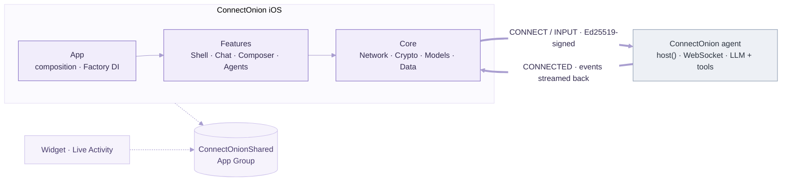

<div align="center">
  
  <h1>ConnectOnion iOS</h1>
  <p><em>A SwiftUI client for ConnectOnion agents — chat, tools, approvals, and live status in real time.</em></p>
  <p>
    
    
    
    
    
  </p>
</div>

---

The app is one end of a protocol; a [`connectonion`](https://github.com/openonion/connectonion)
Python agent is the other. They speak the same wire language: an **Ed25519-signed handshake over a
WebSocket**, then a stream of typed events.

## Team members

| Name | zID |
|---|---|
| Junhua Di | Z5660187 |
| Shengyuan Fan | Z5616162 |
| Yifei Ni | Z5633384 |
| JiXun Wu | Z5534622 |
| Yifan Yang | Z5671741 |
| Yiran Zhou | Z5561218 |

## Highlights

- **Agent-centric flow** — the home lists your agents; tap one for its chats, tap a chat for the conversation (a single `NavigationStack`, with a zoom transition into each agent).
- **Live chat** — streamed events render as typed messages: grouped tool calls, thinking, approvals, ask-user, plan review, onboarding. Agent replies type themselves out with Copy / Regenerate / Share.
- **Brand onion, animated** — the logo is split into its real colour layers and *assembles itself*: a launch splash, the new-chat greeting, the "thinking" indicator, and the first-run welcome all share one onion.
- **Warm & themed** — a warm-paper light mode and a warm-gray (not pure black) dark mode, serif brand type, and Liquid Glass controls.
- **Manage** — search and pin agents and chats; voice dictation plus photo/file attachments in the composer.
- **Beyond the app** — a home-screen widget and a Dynamic Island / Lock Screen Live Activity track the active reply.

## Architecture



**Layering (one-directional):** `Features` depend on `Core`; `Core` never imports `Features` or
SwiftUI. Every service seam is a `protocol + concrete + mock` triad wired through Factory, so views
and view models are fully testable against mock networking, identity, and transport.

## Project structure

<details>
<summary><b>Full source tree</b> — app target, plus widget / shared / config / scripts</summary>

```text
ConnectOnion iOS/            # the app target
├─ App/                      # @main entry + Factory dependency registrations
├─ Core/                     # infrastructure — no SwiftUI, no Features
│  ├─ Network/
│  │  ├─ Transport/          # WebSocket transport (+ protocol + mock)
│  │  ├─ Client/             # ConnectOnionClient, ProtocolCodec, ServerEvent, wire DTOs
│  │  └─ Directory/          # agent discovery + routing (direct / relay)
│  ├─ Crypto/                # Ed25519 identity, Keychain store, signing
│  ├─ Models/                # domain types — Agent/ and Chat/
│  ├─ Persistence/           # SwiftData @Model records
│  ├─ ChatLogic/             # ChatEventReducer (pure, UI-free, testable)
│  ├─ Speech/                # voice dictation (SFSpeechRecognizer)
│  ├─ SystemIntegrations/    # ActivityKit Live Activity controller
│  └─ Support/               # small utilities + preview fixtures
├─ Design/                   # shared styling (Liquid Glass, motion, colors, onion layers)
└─ Features/                 # one folder per product area
   ├─ Shell/                 # app shell, agent-centric navigation, launch splash + welcome
   ├─ Chat/                  # chat screen + Cards/ + Timeline/ (one view per message kind)
   ├─ Composer/              # message composer shared by Chat + Agents
   ├─ Agents/                # agent home, landing, editor, profile
   └─ Settings/

ConnectOnionShared/          # App-Group types shared with the widget
ConnectOnionWidget/          # home-screen widget + Live Activity
Config/                      # Info.plists + entitlements
scripts/                     # run_e2e.sh — one-command real-agent E2E
```

</details>

## Requirements

- **Xcode 26** (iOS 26 SDK) on macOS
- An iOS 26 simulator or device

## Getting started

1. Open `ConnectOnion iOS.xcodeproj` in Xcode 26.
2. Select the **ConnectOnion iOS** scheme and an iOS 26 simulator.
3. Build & run with `Cmd + R`.

To connect to a real agent, host one with the Python framework (`pip install connectonion`,
`co auth`, then `host()`), and add its `0x…` address + endpoint in the app.

## Installation manual

For a clean, assessor-focused setup and verification path, see the
[installation manual](docs/INSTALLATION_MANUAL.md) and its accompanying PDF
(`docs/INSTALLATION_MANUAL.pdf`). As a native iOS application, ConnectOnion is
run on an iOS simulator or device rather than in Docker; the manual records the
assessment arrangement and the no-external-service mock UI path.

## Testing

| Suite | What | How |
|---|---|---|
| Unit (`ConnectOnion iOSTests`) | logic — protocol codec, event reducer, view models, attachments, deep links | `Cmd + U`, or `xcodebuild test` |
| UI (`ConnectOnion iOSUITests`) | mock-seeded UI flows (`--ui-testing`) | `Cmd + U` |
| E2E (`ConnectOnion_iOSE2ETests`) | the **real** app ↔ live agent round-trip (skips in CI) | `./scripts/run_e2e.sh` — see [`scripts/README.md`](scripts/README.md) |

CI (`.github/workflows/ios-tests.yml`) runs the unit + UI suites on every push; the E2E test skips
there because it needs a live agent.

---

<div align="center">
  <sub>Agents powered by <a href="https://github.com/openonion/connectonion">connectonion</a> · <a href="LICENSE">License</a></sub>
</div>
