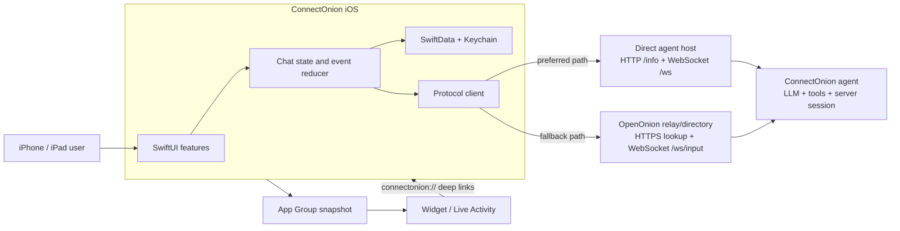
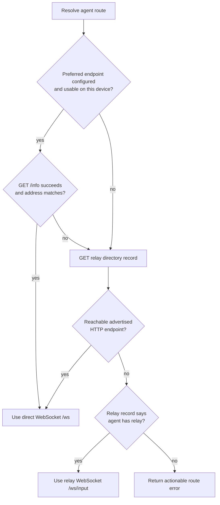
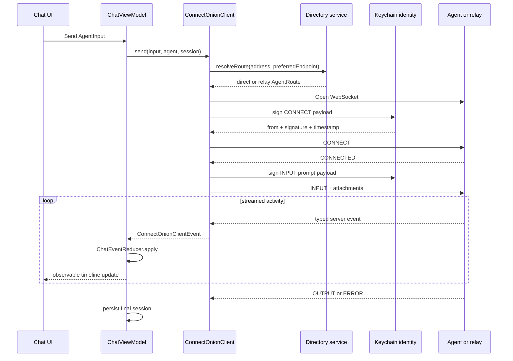

# ConnectOnion iOS — Client Handover

## Document purpose

This document is the operational and technical handover for the ConnectOnion iOS application. It is
intended for the client, product owner, engineering team, release manager, and any future developers
who will maintain or extend the project.

It explains:

- what the product does and where its responsibilities end;
- how the application is structured;
- how the app discovers and communicates with ConnectOnion agents;
- how identity, persistence, attachments, widgets, and Live Activities work;
- the reasoning behind important design decisions;
- how to build, test, release, operate, and troubleshoot the application;
- which values and external accounts must be transferred or replaced at handover;
- known constraints and recommended follow-up work.

This document describes the repository state reviewed on **26 July 2026**. The source code remains
the final authority where implementation and documentation differ.

---

## 1. Executive summary

ConnectOnion iOS is a native SwiftUI client for communicating with ConnectOnion agents. It lets a
user save agent identities, discover whether those agents are online, open persistent conversations,
send text and attachments, observe streamed agent activity, and respond to interactive requests such
as approvals, questions, plan reviews, and onboarding gates.

The iOS repository contains:

- the main iPhone/iPad application;
- a home-screen WidgetKit extension;
- a Live Activity and Dynamic Island presentation;
- shared app/extension data types;
- unit, UI, and optional real-agent end-to-end tests;
- CI configuration for GitHub Actions;
- a local helper script for real-agent end-to-end testing.

The repository does **not** contain the ConnectOnion agent runtime, the relay service, or an
independent application backend. The mobile client depends on the external ConnectOnion protocol and
currently uses the OpenOnion relay/directory at `oo.openonion.ai` when a direct route is unavailable.

### Product responsibilities

The app is responsible for:

- locally managing agents and conversations;
- generating and securely retaining the user's client signing identity;
- resolving a direct or relay route to an agent;
- creating protocol-compliant signed WebSocket messages;
- presenting the event stream as a usable chat timeline;
- retaining active replies while the user navigates elsewhere in the app;
- sharing a minimal agent snapshot with the widget;
- showing reply progress through ActivityKit;
- presenting agent-driven approval and interaction surfaces.

The app is not responsible for:

- running an agent or its tools;
- selecting or operating the agent's language model;
- authenticating the agent host to third-party services;
- storing server-side conversation state;
- operating the public relay/directory;
- guaranteeing end-to-end confidentiality of relayed traffic;
- validating the safety or correctness of actions performed by a remote agent.

---

## 2. Product scope and user journey

### 2.1 Primary user journey

1. The user launches the app.
2. The user adds an agent manually or scans an agent QR code.
3. The app stores the agent address, optional local alias, and optional preferred endpoint.
4. The directory layer checks the preferred direct endpoint first, then advertised endpoints, then
   the relay.
5. The user opens an agent and starts or resumes a conversation.
6. The app establishes a WebSocket connection and sends an Ed25519-signed `CONNECT` envelope.
7. The app sends an Ed25519-signed `INPUT` message containing text and optional attachments.
8. Server events are reduced into timeline items such as thinking, tool calls, approvals, questions,
   files, and the final assistant response.
9. The completed conversation is retained locally with SwiftData.
10. If the user navigates away, the app-level session store keeps the reply running and marks the
    conversation unread when appropriate.

### 2.2 Main capabilities

| Area | Capability |
|---|---|
| Agent management | Add, edit, rename, pin, delete, scan QR code, cache profile information |
| Agent discovery | Preferred direct endpoint, advertised direct endpoint, relay fallback |
| Conversation management | Create, rename, pin, delete, resume, show unread and running state |
| Messaging | Text, photos, camera images, files, voice transcription |
| Agent activity | Thinking, LLM activity, grouped tools, intent, evaluation, compaction |
| Human-in-the-loop | Ask-user, tool approval, plan review, onboarding/invite flow |
| Reply controls | Copy, share, regenerate, edit latest user turn |
| Personalisation | Personality, custom instructions, appearance, fonts, code presentation |
| System integration | Widget, deep links, Live Activity, Dynamic Island |
| Quality support | Unit tests, mock-driven UI tests, optional live-agent E2E test |

### 2.3 Out-of-scope or externally owned capabilities

| Capability | Owner |
|---|---|
| Agent hosting and tool execution | ConnectOnion Python agent/runtime |
| Relay availability and directory records | OpenOnion relay operator |
| Model provider credentials and billing | Agent host/operator |
| Apple Developer account and App Store Connect | Client/release owner |
| Privacy policy, support URL, legal text, store metadata | Client/product owner |
| Production observability beyond local OS logging | Not currently implemented |

---

### 2.4 App UI evidence

The handover package includes the following screenshots as visual anchors for the user-facing
surfaces described in this document. They are captured App, Widget, Live Activity, and simulator
fallback states from the current iOS build. Use the live app as the source of truth when behavior or
copy has changed; the screenshots make the corresponding product area easy to identify during
handover and review.

| Product area | App evidence | What it demonstrates |
|---|---|---|
| Agent home and persistent conversations |  | Agent-first navigation, connection status, conversation list, new chat, and search. |
| Agent list and offline state |  | Offline status, stable agent identity, and the returning-user shell. |
| Add agent and QR entry |  | Address, name, endpoint, QR entry, and review-before-save flow. |
| QR scanner fallback |  | Simulator/device capability fallback for choosing a QR image from Photos. |
| Conversation timeline |  | User turn, tool activity, readable assistant output, copy/share actions, and composer. |
| Multi-turn conversation and collapsed tools |  | Persistent multi-turn history, collapsed tool groups, resolved approvals, and generated output. |
| Human-in-the-loop approval |  | Explicit approval choices and attachment-aware conversation context. |
| Skill command palette |  | Slash-command discovery and bounded composer interaction. |
| Widget shortcut |  | Minimal App Group snapshot, new-chat shortcut, and suggested prompt entry point. |
| Live Activity |  | System-surface reply status outside the app and the completed state. |
| Network recovery |  | Actionable endpoint failure, preserved conversation surface, and reconnect affordance. |

The asset inventory and evidence classifications are maintained in
[`App screenshot index`](assets/app-screenshots/README.md).

## 3. System context



### 3.1 Trust boundaries

There are four important trust boundaries:

1. **The device boundary.** The client private key is generated and retained in iOS Keychain.
2. **The network boundary.** Messages leave the device over `ws`, `wss`, `http`, or `https`,
   depending on the configured/direct route and relay route.
3. **The remote-agent boundary.** An agent may execute tools and return interactive requests. The app
   presents these requests but does not independently sandbox the remote agent.
4. **The extension boundary.** The app shares a deliberately small, encoded agent snapshot with the
   Widget extension through an App Group. Full conversations and the signing key are not placed in
   this shared snapshot.

---

## 4. Repository and target structure

```text
ConnectOnion iOS/
├── App/
│   ├── ConnectOnion_iOSApp.swift       App entry, SwiftData setup, UI-test boot mode
│   └── AppDependencies.swift           Factory registrations
├── Core/
│   ├── ChatLogic/                      App-level session ownership and event reduction
│   ├── Crypto/                         Ed25519 identity and signing
│   ├── Models/
│   │   ├── Agent/                      Agent configuration and capability types
│   │   └── Chat/                       Conversation and timeline domain types
│   ├── Network/
│   │   ├── Client/                     Wire codec, client, events, input DTOs
│   │   ├── Directory/                  Discovery, profile lookup, direct/relay route choice
│   │   └── Transport/                  URLSession WebSocket transport
│   ├── Persistence/                    SwiftData records and Keychain adapter
│   ├── Speech/                         Apple speech recognition integration
│   ├── Support/                        Encoding, sanitisation, preferences, fixtures
│   └── SystemIntegrations/             ActivityKit controller
├── Design/                             Theme, colour, typography, motion, reusable surfaces
├── Features/
│   ├── Agents/                         Agent list, landing, profile, editor, QR scanner
│   ├── Chat/                           Screen, view model, cards, timeline
│   ├── Composer/                       Input, attachments, camera/photos, voice
│   ├── Settings/                       Appearance and personalisation settings
│   └── Shell/                          Navigation, welcome state, sidebar/list shell
└── Resources/                          Animation resources

ConnectOnionShared/                     Types compiled into app and extension targets
ConnectOnionWidget/                     WidgetKit and ActivityKit presentations
ConnectOnion iOSTests/                  Swift Testing unit/integration-style tests
ConnectOnion iOSUITests/                XCTest UI tests and live-agent E2E test
Config/                                 Info.plists and entitlements
scripts/                                Optional local E2E runner and test agent
.github/workflows/ios-tests.yml         Push-triggered unit and UI test workflow
docs/                                   Project and handover documentation assets
```

### 4.1 Xcode targets

| Target | Purpose | Minimum OS |
|---|---|---|
| `ConnectOnion iOS` | Main application | iOS 26.0 |
| `ConnectOnionWidget` | Home-screen widget and Live Activity | iOS 26.0 |
| `ConnectOnion iOSTests` | Unit and logic tests | iOS 26.0 |
| `ConnectOnion iOSUITests` | UI and optional real-agent E2E tests | Project default |

### 4.2 Technology baseline

- Xcode 26
- Swift 6.2
- SwiftUI
- SwiftData
- Observation
- CryptoKit
- URLSession and URLSessionWebSocketTask
- WidgetKit and ActivityKit
- Speech, PhotosUI, AVFoundation, VisionKit, and UniformTypeIdentifiers as required by features

---

## 5. Architectural model

### 5.1 Layering

The project uses a practical layered feature architecture:

```text
App composition
      ↓
Feature UI and feature view models
      ↓
Core domain models and services
      ↓
Apple frameworks and external network services
```

The intended dependency direction is one-way:

- `App` composes the runtime.
- `Features` depend on `Core` and shared design components.
- `Core` does not depend on feature views.
- transport, directory, identity, and client services expose protocols so that mocks can replace
  concrete implementations.

This separation keeps network protocol details out of views and allows most behavior to be tested
without a live server.

### 5.2 Dependency composition

`AppDependencies.swift` registers dependencies using Factory:

| Dependency | Lifetime | Reason |
|---|---|---|
| `IdentityProviding` | Singleton | One stable client identity per installation |
| `AgentDirectoryServicing` | Singleton | Stateless/shared directory access |
| `ConnectOnionClientProviding` | Unscoped | Every active conversation needs an independent transport |
| `AgentReplyLiveActivityController` | Singleton | Central ownership of ActivityKit updates |

The unscoped chat client is an important design constraint. A single shared WebSocket client would
allow a new conversation to replace or close another conversation's receive stream.

### 5.3 State ownership

State exists at three levels:

1. **Persistent records** in SwiftData:
   - `AgentConfigRecord`
   - `ConversationRecord`
2. **App-lifetime chat runtime** in `ChatSessionStore`:
   - retained `ChatViewModel` instances;
   - running conversation IDs;
   - foreground/visibility tracking;
   - unread completion state.
3. **Screen presentation state** in SwiftUI views:
   - navigation path;
   - sheets, dialogs, scanner presentation;
   - composer state and temporary pending input.

`RootView` owns one `ChatSessionStore` and injects it into the environment. This ensures that
navigation does not destroy in-progress chat work.

### 5.4 Navigation

`AppShellView` uses a single typed `NavigationStack` with three route cases:

- agent home by agent address;
- new chat by agent address;
- existing conversation by local conversation UUID.

This agent-first hierarchy mirrors the product model: users select an agent, then select or start a
conversation.

---

## 6. Runtime flows

### 6.1 Application startup

1. `ConnectOnion_iOSApp` creates a SwiftData schema containing agent and conversation records.
2. Normal launches use a persistent model container in Application Support.
3. UI-test launches containing `--ui-testing` install mock dependencies and use an in-memory seeded
   model container.
4. `RootView` creates and injects the app-lifetime `ChatSessionStore`.
5. Returning users with saved agents see the launch animation; first-run users go directly to the
   welcome/add-agent state.
6. `AppShellView` starts profile refresh, publishes a widget snapshot, applies appearance settings,
   and tracks scene activity.

### 6.2 Adding an agent

An agent can be entered manually or populated through QR scanning. The stored values are:

- agent address;
- optional local alias;
- optional preferred HTTP endpoint;
- timestamps;
- optional cached agent information;
- optional pin timestamp.

The QR parser supports current ConnectOnion add links, bare agent addresses, and selected legacy
hosted formats. Before changing QR behavior, update both `AgentQRCodePayload` and its test suite.

### 6.3 Agent discovery and route selection

Route selection is implemented by `AgentDirectoryService`.



Important details:

- the default relay base is `wss://oo.openonion.ai`;
- directory lookup is performed through the normalized HTTPS base at
  `/api/relay/agents/{address}`;
- direct profile probes call `/info`;
- direct WebSocket connections use `/ws`;
- relay input connections use `/ws/input`;
- a direct `/info` response must report the exact expected agent address;
- on a physical device, loopback endpoints such as `localhost` and `127.0.0.1` are rejected because
  they refer to the phone, not the developer's computer;
- simulator builds may use loopback endpoints;
- an unreachable preferred endpoint is not terminal: the app continues to advertised endpoints and
  relay fallback.

### 6.4 Sending a message



The client responds to server `PING` messages with `PONG`. Malformed individual streamed events are
logged and skipped so one invalid event does not necessarily terminate a valid reply stream.

### 6.5 Reconnection and resume

Conversation records retain:

- the remote session ID;
- the raw server session payload;
- the last rendered event ID;
- the reduced timeline.

On reconnect, the client can send the current session plus `last_msg_id`. The server may return a
canonical snapshot. The view model reconciles that snapshot while protecting locally resolved cards
and unsynchronised local work.

### 6.6 Interactive events

The reducer recognises and presents:

| Event | User-facing result |
|---|---|
| `tool_call` / `tool_result` | Running/completed tool activity |
| `llm_call` / `llm_result` | Thinking/model activity and usage |
| `thinking` | Agent reasoning/status note |
| `assistant` | Assistant message |
| `agent_image` | Image added to the latest assistant response |
| `intent` | Interpreted intent |
| `eval` | Evaluation result |
| `compact` | Context compaction status |
| `tool_blocked` | Blocked tool notice |
| `files_received` | Files returned by the agent |
| `ulw_turns_reached` | Work-limit notice and waiting state |
| `ask_user` | Text, choice, multi-select, or field input card |
| `approval_needed` | Approve/reject controls and scope |
| `plan_review` | Approve or request revision |
| `ONBOARD_REQUIRED` | Invite/payment onboarding card |
| `ONBOARD_SUCCESS` | Onboarding completion and pending-input resume |

Unknown event types are deliberately retained as `.unknown` timeline data instead of being silently
misrepresented as assistant text. This provides forward compatibility and makes protocol mismatches
diagnosable.

### 6.7 Background navigation behavior

An active chat view model is retained by `ChatSessionStore` even if the user navigates away. The
store:

- publishes which conversations are generating;
- marks an off-screen completed reply unread;
- clears unread state when the conversation is visible while the app is active;
- stops and removes the associated client when a conversation is deleted.

This behavior is app-lifetime, not an unlimited background execution guarantee. iOS may still
suspend or terminate the process.

---

## 7. Network protocol

### 7.1 Transport

The application uses `URLSessionWebSocketTask` through the `WebSocketTransporting` abstraction.
Messages are JSON text frames represented internally by the `JSONValue` type.

The protocol client exposes:

- send input;
- reconnect;
- ask-user response;
- approval response;
- onboarding submission;
- plan-review response;
- disconnect.

### 7.2 Client messages

| Type | Signed | Main fields |
|---|---|---|
| `CONNECT` | Yes | payload, from, signature, timestamp, session ID, session, last message ID |
| `INPUT` | Yes | input ID, prompt, timestamp, session ID, images, files, optional relay destination |
| `ASK_USER_RESPONSE` | No separate envelope | answer |
| `APPROVAL_RESPONSE` | No separate envelope | approved, scope, optional mode and feedback |
| `ONBOARD_SUBMIT` | Yes | invite code and/or payment |
| `PLAN_REVIEW_RESPONSE` | No separate envelope | message |
| `PONG` | No | type |

For relay routes, the intended agent address is included as `to`. For direct routes it is omitted
where routing is already implicit.

### 7.3 Server control messages

The client treats these top-level types specially:

- `CONNECTED` — handshake success and optional canonical session/chat snapshot;
- `OUTPUT` — final output and optional canonical state;
- `ERROR` — terminal server error;
- `PING` — heartbeat requiring `PONG`.

Other server messages flow into `ChatEventReducer`.

### 7.4 Compatibility requirements

The mobile and agent implementations must agree on:

- canonical JSON signing behavior;
- timestamp and signature representation;
- agent address derivation;
- event type spelling and payload keys;
- session ID semantics;
- the meaning of `server_newer`;
- attachment data URL encoding;
- direct and relay endpoint paths.

Any server protocol change should be introduced with fixtures/tests in the iOS repository before
deployment. Where possible, add tolerant decoding first, deploy the client, and only then make the
new server behavior mandatory.

---

## 8. Identity, security, and privacy

### 8.1 Client identity

On first use, the app creates a `Curve25519.Signing.PrivateKey` through CryptoKit. In this context the
key is used as an Ed25519 signing identity.

- The raw private key is stored in Keychain.
- The Keychain service is `com.connectonion.ios.identity`.
- The account name is `ed25519-private-key`.
- Accessibility is `AfterFirstUnlockThisDeviceOnly`.
- The client address is `0x` followed by the hex-encoded public key.
- Payloads are JSON-encoded with sorted keys before signing.
- The identity can be regenerated, which changes the client address.

Regenerating identity should be treated as a user-visible account/identity reset. Remote agents may
no longer recognise the device as the same caller.

### 8.2 What signing guarantees

The signature allows the receiving agent to verify that a signed payload was produced by the holder
of the corresponding private key and that the signed payload was not modified.

Signing does **not** by itself provide:

- encryption;
- relay confidentiality;
- server identity pinning;
- user account recovery;
- protection from a malicious but correctly addressed agent;
- signed integrity for every follow-up control response.

Use `wss`/`https` for production routes. A manually entered `http`/`ws` endpoint may be acceptable
for trusted local development but should not be treated as confidential on an untrusted network.

### 8.3 Local data

| Data | Storage | Notes |
|---|---|---|
| Client private signing key | iOS Keychain | Device-only accessibility |
| Agent address, alias, endpoint, cached profile | SwiftData | Local app container |
| Conversation messages and raw session | SwiftData | Encoded data blobs in local app container |
| Appearance and personalisation preferences | UserDefaults/AppStorage | Local preferences |
| Widget shortcut snapshot | App Group UserDefaults | Minimal agent metadata only |
| Temporary attachment data | In-memory and timeline/session payloads | May be persisted as encoded conversation content |

The app currently stores conversation content locally without an additional app-level encryption
layer. iOS Data Protection still applies according to the device and container configuration, but
clients with stronger compliance requirements should perform a dedicated data-protection review.

### 8.4 User-granted permissions

The app declares:

- local network access;
- microphone access;
- speech recognition;
- photo library access;
- camera access;
- Live Activities.

The permission purpose strings live in `Config/ConnectOnion-Info.plist`. Any change in feature use
must be reflected in the plist, App Store privacy answers, and the client privacy policy.

### 8.5 Logging

Network routing and malformed-event diagnostics use `OSLog`. Logs should avoid full prompts,
attachment payloads, private keys, signatures, or sensitive tool data. Before adding new logging,
use privacy annotations deliberately and verify the Release behavior.

### 8.6 Security review recommendations

Before a public or regulated production launch:

1. Require `https`/`wss` except for an explicit developer mode.
2. Review whether all post-handshake control messages should also be signed.
3. Add replay-protection requirements on the server side for signed timestamps/input IDs.
4. Document relay retention and access policies.
5. Complete a privacy data inventory for prompts, images, files, speech, and agent-returned files.
6. Review Keychain access group and migration behavior under the final bundle identifiers.
7. Consider certificate pinning only if the client can operate a reliable rotation process.
8. Threat-model QR codes and manually supplied endpoints as untrusted input.
9. Confirm how downloaded/received files are scanned, previewed, exported, and retained.

---

## 9. Persistence and data model

### 9.1 Agent record

`AgentConfigRecord` stores:

- `address`;
- `alias`;
- `preferredEndpoint`;
- created, updated, and last-connected dates;
- cached encoded `AgentInfo`;
- pin date.

Display name precedence is:

1. local alias;
2. remote profile name;
3. shortened agent address;
4. full raw address.

The local alias is intentionally independent from the remote profile name, so the user can apply
their own stable naming.

### 9.2 Conversation record

`ConversationRecord` stores:

- local UUID;
- agent address;
- optional remote session ID;
- title;
- timestamps;
- approval mode;
- encoded `[ChatItem]`;
- optional raw server session;
- last rendered event ID;
- pin date;
- unread flag.

The default title is derived from the first user message, image, or file. Messages and raw session
data are encoded blobs rather than separate SwiftData child entities.

### 9.3 Persistence design justification

Encoding the event timeline as a single blob was chosen because:

- the server protocol already delivers nested polymorphic event data;
- a conversation is normally loaded and replaced as a unit;
- it avoids a large graph of persistence-only entity types;
- unknown protocol events can be retained losslessly.

Trade-offs:

- individual message querying is not efficient;
- large conversations rewrite a larger value;
- schema evolution must preserve `Codable` compatibility;
- fine-grained migrations and analytics are harder;
- attachments can increase the local database size substantially.

If conversation scale or cross-device sync becomes a requirement, re-evaluate this decision before
adding more fields to the blob.

### 9.4 Migration caution

The persistent container is created directly from the current schema. There is no explicit
versioned `SchemaMigrationPlan` in the current implementation. Add a migration plan before making
breaking model changes such as:

- renaming or removing stored properties;
- changing non-optional property types;
- splitting message blobs into entities;
- introducing uniqueness constraints;
- changing the representation of existing enum raw values.

Migration should be tested against a copy of a real previous-version store, not only a fresh
installation.

---

## 10. Attachments, speech, and personalisation

### 10.1 Attachments

Images and files are sent inline as data URLs in the WebSocket input frame.

Current default limits:

| Limit | Value |
|---|---:|
| Maximum attachment count | 10 |
| Maximum source file size | 10 MiB |
| Maximum encoded input frame | 900 KiB |
| Estimation safety margin | 64 KiB |

Images are normalised to JPEG and progressively resized/compressed across a set of size and quality
candidates until they fit the encoded budget. The transport performs a final frame-size check before
sending.

The 10 MiB source-file limit and 900 KiB input-frame limit serve different purposes. A file may be
acceptable to select but still make the combined encoded message too large. UI validation and final
transport validation must remain aligned.

For significantly larger files, do not continue increasing the WebSocket frame limit. Introduce a
separate authenticated upload flow and send references in the agent protocol.

### 10.2 Voice input

Voice input uses Apple's speech-recognition stack. It depends on both microphone and speech
recognition permissions. Availability, supported locale, and recognition behavior depend on the OS
and device. Voice input produces composer text; it is not a separate server protocol.

### 10.3 Personalisation

Selected personality and custom instructions are wrapped around the visible user request before
transport. The signed payload and top-level prompt use the same transmitted text.

The UI removes this transport-only wrapper, plus recognised leading system reminder envelopes, when
rendering canonical history. This prevents internal instruction context from appearing as if the
user typed it.

Important maintenance rule: the wrapper markers and removal logic are a compatibility contract.
Changes require round-trip, regeneration, onboarding-resume, and canonical-history tests.

---

## 11. Widget, deep links, and Live Activity

### 11.1 App Group

The main app and widget share:

`group.com.romantcD.ConnectOnion-iOS`

The identifier appears in:

- `ConnectOnionShared/ConnectOnionSharedData.swift`;
- `Config/ConnectOnion.entitlements`;
- `Config/ConnectOnionWidget.entitlements`;
- Apple Developer provisioning configuration.

All locations and provisioning profiles must change together if the client adopts a new identifier.

### 11.2 Widget snapshot

The app writes an encoded `ConnectOnionWidgetSnapshot` to App Group `UserDefaults`. It contains:

- update date;
- selected agent addresses;
- display names;
- subtitles;
- last-used dates;
- suggested prompts.

It does not contain full conversations or the private key. The widget uses the snapshot for quick
agent access and suggested new chats.

### 11.3 Deep links

The registered URL scheme is `connectonion`.

| Link | Purpose |
|---|---|
| `connectonion://new-chat?agent={address}` | Open a new chat |
| `connectonion://new-chat?agent={address}&suggestion={text}` | Open a new chat with suggested text |
| `connectonion://conversation?id={uuid}` | Open an existing local conversation |
| `connectonion://scan-agent` | Open the agent scanner |

Deep links use local data. A conversation link only works when the referenced conversation exists
on that installation.

Custom URL schemes can be claimed by other apps. If links will be distributed publicly or used for
sensitive entry points, add Universal Links with Associated Domains.

### 11.4 Live Activity

`AgentReplyLiveActivityController` publishes phases such as:

- connecting;
- running;
- tool use;
- waiting for user input;
- completed;
- failed;
- stopped.

The widget extension renders these states on the Lock Screen and Dynamic Island and links back to the
conversation. ActivityKit is a presentation surface, not a guarantee that network processing will
continue indefinitely in the background.

---

## 12. UI and design system

The product uses a central design layer instead of hard-coding styling in each feature.

Key design components include:

- semantic application colours;
- warm light and dark canvases;
- brand and UI font preferences;
- common motion timings;
- Liquid Glass surfaces;
- quiet press/button treatments;
- onion logo layers and Lottie animation;
- shared sidebar and card presentation.

### Design rationale

- **Agent-centric navigation** reflects the user's primary mental model.
- **Typed timeline rows** keep complex agent activity readable without flattening everything into
  chat bubbles.
- **Human-in-the-loop cards** make approvals and required input explicit and actionable.
- **A warm, non-pure-black palette** gives the product a distinctive identity while supporting dark
  mode.
- **Shared motion and onion assets** provide continuity across launch, thinking, welcome, and empty
  states.
- **Settings-backed type choices** improve readability for different users and code-heavy output.

When extending the UI, reuse semantic colours and shared components. Do not bind feature code to
specific RGB values or duplicate interaction cards.

### Accessibility

The project defines stable accessibility identifiers used by UI tests and combines labels for
complex branded components where needed. New interactive features should include:

- VoiceOver labels and values;
- Dynamic Type behavior;
- sufficient contrast in both appearances;
- reduced-motion consideration;
- keyboard and focus behavior;
- stable accessibility identifiers for automated flows.

Accessibility should be verified on physical devices before release.

---

## 13. External dependencies

Swift Package Manager resolves:

| Package | Current resolved version | Use |
|---|---:|---|
| Factory | 2.5.3 | Dependency injection |
| HighlighterSwift | 3.1.0 | Syntax highlighting for code blocks |
| Lottie | 4.6.1 | Onion animation |

Apple framework dependencies are supplied by the iOS SDK.

### Dependency policy recommendations

- Commit `Package.resolved`.
- Upgrade one package at a time.
- Build both the app and widget after dependency changes.
- Let GitHub Actions run the full unit/UI suite after push.
- Review release notes for minimum OS, Swift concurrency, and privacy manifest changes.
- Avoid adding a package where a small, stable Apple framework implementation is sufficient.

---

## 14. Build and local development

### 14.1 Prerequisites

- macOS capable of running Xcode 26;
- Xcode 26 with the iOS 26 SDK;
- an iOS 26 simulator or compatible physical device;
- access to the Git repository;
- Apple signing access for physical-device or distribution builds;
- optional Python/ConnectOnion environment for real-agent E2E work.

### 14.2 First build

1. Clone the repository.
2. Open `ConnectOnion iOS.xcodeproj`.
3. Allow Swift Package Manager to resolve dependencies.
4. Select the `ConnectOnion iOS` scheme.
5. Select an iOS 26 simulator.
6. Build and run.

No `.xcworkspace` created by CocoaPods is required.

### 14.3 Physical-device connectivity

For a locally hosted agent:

- the iPhone and host machine should be on a mutually reachable network;
- use the host machine's LAN address, not `localhost`;
- allow incoming connections through the host firewall;
- make sure `/info` is reachable from the phone;
- make sure the corresponding `/ws` WebSocket endpoint is available;
- accept the iOS local-network permission prompt.

Corporate, university, guest, VPN, and client-isolated Wi-Fi networks may block peer-to-peer access.
In that case use the relay or a reachable secure endpoint.

### 14.4 Repository test policy

Project instructions require:

- prefer local build/compile checks while iterating;
- do not run tests locally after code changes unless a specific local test/debug run is explicitly
  requested;
- run unit and UI tests after push through `.github/workflows/ios-tests.yml`.

Future maintainers should preserve this workflow unless the project owner updates `AGENTS.md`.

---

## 15. Testing and CI

### 15.1 Unit and logic coverage

The test target covers important contracts including:

- agent-address normalisation;
- signed connect/input payloads;
- direct and relay route selection;
- fallback from unreachable preferred endpoints;
- QR payload compatibility;
- event reduction and out-of-order tool results;
- ask-user, approval, onboarding, plan review, and work-limit flows;
- unknown event preservation and lossy enum decoding;
- custom-instruction transport and visible-history sanitisation;
- attachment encoding and frame budgeting;
- attachment-only inputs and recovery;
- reply regeneration and latest-turn editing rollback;
- app-lifetime session/unread behavior;
- widget snapshot and deep-link round trips;
- typography preferences and syntax highlighting.

### 15.2 UI coverage

The mock-driven UI suite covers:

- seeded and empty launch states;
- normal streaming chat;
- editing/regenerating the latest turn;
- attachment entry points;
- agent landing and capability sections;
- add, rename, delete, and navigation flows;
- conversation rename/delete;
- approval, ask-user, onboarding, and plan-review cards;
- sidebar accessibility.

### 15.3 End-to-end coverage

`ConnectOnion_iOSE2ETests.testRealAgentEndToEnd` exercises the real app-to-agent round trip. It is
launched through `scripts/run_e2e.sh` and intentionally skips in normal CI because it requires a
live agent and suitable environment.

Read `scripts/README.md` before using the E2E helper.

### 15.4 GitHub Actions

`.github/workflows/ios-tests.yml` runs on every push and on manual dispatch.

The workflow:

- uses a macOS runner;
- prefers an installed Xcode 26 toolchain;
- targets an `iPhone 17 Pro` simulator on the latest OS;
- disables parallel testing;
- retries failed tests up to three iterations to tolerate slow shared-runner UI timing;
- has a 60-minute job timeout.

### 15.5 Release quality gate

Before a release candidate is approved:

1. Confirm the pushed commit has a green CI run.
2. Build the Release configuration.
3. Smoke-test agent add/scan, direct routing, relay routing, messaging, and interactive cards.
4. Test on at least one physical iPhone.
5. Test denied and granted permission states.
6. Verify widget deep links and refresh.
7. Verify Live Activity start, update, completion, failure, and tap-through.
8. Verify upgrade from the previous production build with real retained conversations.
9. Validate dark mode, light mode, Dynamic Type, and VoiceOver basics.
10. Review App Store privacy and entitlement configuration.

---

## 16. Signing, identifiers, and release handover

The repository currently contains project-specific signing values:

| Setting | Current repository value |
|---|---|
| Development Team | `GQAQ5635CV` |
| App bundle identifier | `com.junhuadi.ConnectOnion-iOS` |
| Widget bundle identifier | `com.junhuadi.ConnectOnion-iOS.Widget` |
| App Group | `group.com.romantcD.ConnectOnion-iOS` |
| Marketing version | `1.0` |
| Build number | `1` |

These are configuration values, not a recommendation for the client's final production namespace.

### 16.1 Items the client must own

- Apple Developer Program organisation and legal agreements;
- App Store Connect app record;
- final bundle identifiers;
- App Group capability;
- App and Widget provisioning profiles/certificates or managed signing access;
- distribution signing permissions for the release team;
- App Store roles;
- store listing, screenshots, support URL, marketing URL, and privacy policy URL;
- age rating and content declarations;
- App Privacy questionnaire;
- export compliance answers;
- production relay/service ownership and support contacts.

### 16.2 Identifier migration warning

Changing the bundle identifier creates a different application identity unless handled as part of
the existing App Store record. Changing the App Group can make previously shared widget data
unavailable. Changing signing/keychain access configuration can affect access to the existing client
identity.

Coordinate identifier changes before production distribution and test an upgrade signed exactly as
the final app will be signed.

### 16.3 Suggested release process

1. Create a release branch from a green `main`.
2. Update marketing version and monotonically increase build number.
3. Confirm signing and entitlements for both app and widget.
4. Confirm production relay and network policy.
5. Push and wait for green GitHub Actions.
6. Archive the app with Xcode using the Release configuration.
7. Validate the archive.
8. Upload to App Store Connect.
9. Distribute to an internal TestFlight group.
10. Execute the release quality gate.
11. Expand TestFlight distribution or submit for review.
12. Tag the exact released commit and record the App Store build number.

---

## 17. Configuration inventory

### 17.1 Source-controlled configuration

| Configuration | Location |
|---|---|
| Default relay URL | `Core/Network/Directory/AgentDirectoryService.swift` |
| URL scheme and permission text | `Config/ConnectOnion-Info.plist` |
| App Group entitlements | `Config/ConnectOnion.entitlements`, `Config/ConnectOnionWidget.entitlements` |
| Shared App Group constant | `ConnectOnionShared/ConnectOnionSharedData.swift` |
| Bundle IDs, team, versions, deployment target | Xcode project build settings |
| Dependency versions | `Package.resolved` |
| Test workflow | `.github/workflows/ios-tests.yml` |
| E2E behavior | `scripts/run_e2e.sh`, `scripts/agent_server.py` |

### 17.2 Secrets

No production API key is expected to be committed in the iOS source. The app's signing private key is
generated per installation at runtime and stored in Keychain.

If future integrations require secrets:

- do not commit them to the repository;
- do not place durable service secrets in the client binary;
- use a server-mediated token flow;
- store only user/device credentials in Keychain;
- use GitHub Actions secrets only for CI needs;
- document owner, rotation, expiry, and emergency revocation.

---

## 18. Operational support and troubleshooting

### 18.1 Agent appears offline

Check:

1. The saved address is valid and matches the `/info` response.
2. The preferred endpoint is a base HTTP(S) URL, not the WebSocket URL itself.
3. The agent host is running.
4. The phone can reach `{endpoint}/info`.
5. The phone is not trying to use `localhost`.
6. Local-network permission is granted.
7. Firewall, VPN, or Wi-Fi isolation is not blocking the connection.
8. The directory has a current record and relay presence.

Profile polling includes offline hysteresis to reduce status flapping, so a status transition may not
be instantaneous.

### 18.2 Connection fails but the agent is online

- Verify direct `/info` returns the exact agent address.
- Verify the WebSocket path is `/ws`.
- Remove or correct an obsolete preferred endpoint.
- Confirm relay fallback is available.
- Inspect device logs in the `AgentDirectory` and `AgentClient` categories.
- Compare the agent/server protocol version and recent server changes.

### 18.3 Message is too large

- Remove one or more attachments.
- Use a smaller file.
- Let the composer compress images.
- Remember that base64 increases encoded size.
- Do not raise only the UI limit; the transport enforces the final frame budget.

### 18.4 Reply remains in a running or waiting state

- A human-input card may require a response.
- The WebSocket may have been suspended or disconnected.
- Confirm whether `OUTPUT` or `ERROR` was received.
- Inspect the retained conversation after navigating away and back.
- Reconnect/resume using the stored session and last rendered event ID.
- Check whether the server introduced a new event type now shown as unknown.

### 18.5 Widget is stale or empty

- Launch the main app so it can publish a snapshot.
- Confirm app and widget use the same App Group entitlement.
- Confirm provisioning includes the App Group for both targets.
- Verify the main app has saved agents.
- Confirm WidgetKit timeline reload is requested after data changes.
- Re-add the widget after an identifier/provisioning change.

### 18.6 Live Activity does not appear

- Confirm Live Activities are enabled for the app and device.
- Confirm the Info.plist supports Live Activities.
- Test on supported hardware/OS.
- Confirm ActivityKit authorization.
- Confirm the app actually starts the activity for an active reply.
- Treat simulator results as development guidance, not final device verification.

### 18.7 Camera, microphone, speech, or photos are unavailable

- Check Settings for denied permissions.
- Confirm the purpose string is present.
- Use supported physical hardware for final validation.
- Confirm parental/MDM restrictions.
- Handle unavailable services as a normal user-facing state.

### 18.8 Identity unexpectedly changed

Possible causes include:

- the user explicitly regenerated identity;
- the app was reinstalled and Keychain state did not persist as expected;
- bundle/signing/keychain configuration changed;
- invalid stored key data was removed;
- device migration or managed-device policy affected Keychain access.

Record the old and new public client addresses when investigating. Never export the raw private key
into ordinary logs or support tickets.

---

## 19. Key design decisions and justifications

### Decision 1: Native SwiftUI and an iOS 26 baseline

**Decision:** Build with SwiftUI, SwiftData, Observation, WidgetKit, and ActivityKit on iOS 26.

**Why:** It enables a modern, cohesive Apple-platform UI and reduces compatibility branches for
older OS versions.

**Trade-off:** The addressable device base is limited to iOS 26 and later, and Xcode 26 is required.

### Decision 2: Protocol-oriented service seams

**Decision:** Define protocols for transport, directory, identity, and client behavior.

**Why:** Network and identity behavior can be tested deterministically with mocks, and UI tests can
run without an external agent.

**Trade-off:** There are more types and dependency registrations than in a tightly coupled app.

### Decision 3: One network client per retained chat session

**Decision:** Do not scope `ConnectOnionClient` as a singleton.

**Why:** Each chat owns an independent WebSocket receive stream. Starting another chat cannot
replace an existing stream.

**Trade-off:** Concurrent chats may hold multiple network connections and require disciplined
lifecycle cleanup.

### Decision 4: Direct-first discovery with relay fallback

**Decision:** Prefer verified direct routes but continue to relay when direct connectivity fails.

**Why:** Direct LAN connections can reduce latency and relay dependency, while fallback keeps agents
reachable across NATs and isolated networks.

**Trade-off:** Discovery requires multiple probes and produces more complex failure states.

### Decision 5: Verify direct identity through `/info`

**Decision:** Accept a direct route only when `/info` returns the expected agent address.

**Why:** It avoids connecting to the wrong service at a mistyped, stale, or reused endpoint.

**Trade-off:** The agent must expose a compatible and responsive HTTP info endpoint before WebSocket
connection.

### Decision 6: Signed protocol envelopes with a device key

**Decision:** Generate a device-held Ed25519 identity and sign canonical payloads.

**Why:** The agent can authenticate message origin without requiring a conventional account/password
flow.

**Trade-off:** Identity recovery and multi-device identity sharing are not built in, and signing
does not provide encryption.

### Decision 7: Pure event reducer

**Decision:** Convert streamed server events into timeline data with `ChatEventReducer`.

**Why:** Event interpretation is centralised, UI-free, testable, and resilient to out-of-order or
unknown data.

**Trade-off:** Protocol evolution must update a central mapping and corresponding typed views.

### Decision 8: Retain unknown protocol events

**Decision:** Decode unsupported events into `.unknown` items with raw payloads.

**Why:** Forward compatibility and diagnosis are better than silent data loss or incorrect assistant
messages.

**Trade-off:** Users may see an unsupported-event representation until the client is updated.

### Decision 9: Store a reduced conversation snapshot locally

**Decision:** Persist encoded timeline and raw server session in each conversation record.

**Why:** Conversations restore quickly, can resume, and can reconcile with canonical server state.

**Trade-off:** Blob growth and migration complexity must be monitored.

### Decision 10: Keep active reply state above navigation

**Decision:** Own chat view models in an app-lifetime session store.

**Why:** Navigating away should not cancel an agent task or lose its progress.

**Trade-off:** The store must explicitly stop deleted sessions and manage unread/visibility state.

### Decision 11: Inline data URLs with a strict frame budget

**Decision:** Send current attachment payloads in the input frame and aggressively compress images.

**Why:** It keeps the initial protocol and agent integration simple.

**Trade-off:** It is unsuitable for large files and increases frame and persistence size.

### Decision 12: Minimal App Group snapshot for the widget

**Decision:** Share only shortcut metadata, not the main SwiftData store.

**Why:** The extension stays simple and does not need to coordinate database access or receive
sensitive full-conversation data.

**Trade-off:** The widget is a snapshot and depends on the app to publish updates.

---

## 20. Known constraints, risks, and recommended backlog

The following items should be reviewed and prioritised by the client.

### High priority before production ownership

1. **Transfer signing and App Store ownership.** Replace or formally adopt the existing Team ID,
   bundle IDs, App Group, and provisioning.
2. **Confirm relay ownership and SLA.** The app currently depends on a source-coded public relay
   default. Define production ownership, uptime expectations, incident contacts, and change control.
3. **Complete privacy and security review.** Prompts and attachments can contain sensitive data and
   are stored locally and sent to remote agents.
4. **Add an explicit SwiftData migration plan.** Required before breaking persistent model changes.
5. **Validate production transport policy.** Decide whether insecure direct `http`/`ws` endpoints
   remain allowed.
6. **Verify protocol governance.** Establish versioning, compatibility tests, and release order
   between mobile client, relay, and agent runtime.

### Medium priority

1. Add Universal Links for externally distributed links.
2. Add production crash reporting and privacy-reviewed diagnostics.
3. Add configurable environment/relay selection instead of a source-coded default.
4. Define retention controls such as delete all conversations, clear cached profiles, and export.
5. Add explicit user-facing identity backup/recovery policy, or clearly document that identity is
   device-local and replaceable.
6. Move large attachments to an authenticated upload/download service.
7. Add performance testing for long conversations and attachment-heavy stores.
8. Add explicit migration/upgrade fixtures to CI.
9. Review background behavior expectations against iOS suspension rules.
10. Add localisation if markets beyond the current English UI are required.

### Ongoing maintenance risks

- agent protocol events may evolve faster than the mobile release cycle;
- the fixed iOS 26 baseline requires current build infrastructure;
- shared macOS CI runners may produce timing-related UI test retries;
- relay and LAN routing failures can look similar without good diagnostics;
- encoded conversation blobs can grow with images, files, and detailed tool traces;
- settings markers and canonical-history sanitisation must remain compatible;
- changes to App Group or signing can affect widget data and device identity continuity.

---

## 21. Maintenance playbooks

### 21.1 Adding a new server event

1. Add or confirm the payload contract with the agent team.
2. Add decoding fields to domain models only where needed.
3. Add the event case to `ChatEventReducer`.
4. Decide its session-state effect.
5. Create or reuse a dedicated timeline/card view.
6. Preserve unknown fields if forward compatibility matters.
7. Add reducer tests for normal and malformed payloads.
8. Add UI coverage for interactive events.
9. Deploy with a backward-compatible server/client sequence.

### 21.2 Adding a new interactive response

1. Define the server request and client response types.
2. Extend `ConnectOnionClientProviding`.
3. Implement encoding in `ProtocolCodec`.
4. Implement transport in `ConnectOnionClient` and its mock clients.
5. Add reducer and timeline state.
6. Build the interaction card with clear pending, success, and error states.
7. Ensure navigation away does not lose the pending interaction.
8. Add rollback/retry behavior.
9. Cover unit and UI flows.

### 21.3 Changing persistence

1. Inventory real stored data from the previous release.
2. Define a versioned schema and migration stage.
3. Keep enum decoding tolerant where old raw values may exist.
4. Test upgrade, downgrade expectations, failed migration, and low-storage behavior.
5. Check widget/shared data separately.
6. Release through TestFlight before production.

### 21.4 Changing identifiers or signing

1. Confirm the App Store Connect record and client Apple team.
2. Update app and widget bundle identifiers together.
3. Update App Group in source, entitlements, and Developer portal.
4. Recreate/refresh provisioning.
5. Verify Keychain identity continuity.
6. Verify widget snapshot access.
7. Archive and validate with the final signing identity.
8. Test upgrade from an installed previous build.

### 21.5 Updating dependencies

1. Read package release notes.
2. Update one package and `Package.resolved`.
3. Perform local compile checks for app and widget.
4. Push the change.
5. Wait for GitHub Actions unit and UI tests.
6. Smoke-test the affected surface.

---

## 22. Ownership and handover checklist

### 22.1 Repository and engineering

- [ ] Client administrators have repository access.
- [ ] Branch protection and required checks are configured.
- [ ] At least two client maintainers can review and merge.
- [ ] CI usage/billing ownership is confirmed.
- [ ] Release tags and versioning convention are agreed.
- [ ] Dependency update responsibility is assigned.
- [ ] Protocol change approval process is documented.

### 22.2 Apple platform

- [ ] Apple Developer membership is owned by the client.
- [ ] App Store Connect roles are assigned.
- [ ] Distribution certificates/signing access are available.
- [ ] App and Widget identifiers are registered.
- [ ] App Group is registered and attached to both identifiers.
- [ ] Provisioning works on a client-owned device.
- [ ] TestFlight upload has been completed by a client release owner.
- [ ] Store metadata, privacy policy, and support URLs are owned by the client.

### 22.3 External services

- [ ] Relay service owner and support contact are recorded.
- [ ] Relay production URL and environment policy are approved.
- [ ] Agent runtime owner and compatible version are recorded.
- [ ] Incident escalation path across app, relay, and agent teams is agreed.
- [ ] Service retention, privacy, and availability expectations are documented.

### 22.4 Operational readiness

- [ ] Green CI is required before release.
- [ ] Physical-device smoke-test checklist is assigned.
- [ ] Upgrade/migration testing is assigned.
- [ ] Crash and support intake process is established.
- [ ] Security incident contact and key/token revocation process are established.
- [ ] App Store review response owner is assigned.

### 22.5 Knowledge transfer

- [ ] New maintainers have walked through app composition and state ownership.
- [ ] New maintainers can run a simulator build.
- [ ] New maintainers can connect to a direct test agent.
- [ ] New maintainers can validate relay fallback.
- [ ] New maintainers understand the signed protocol and what it does not protect.
- [ ] New maintainers can add a protocol event and its tests.
- [ ] New maintainers can archive and upload a TestFlight build.

---

## 23. Source map for future maintainers

| Concern | Primary source |
|---|---|
| App boot and persistence container | `ConnectOnion iOS/App/ConnectOnion_iOSApp.swift` |
| Dependency registration | `ConnectOnion iOS/App/AppDependencies.swift` |
| Navigation and deep-link handling | `ConnectOnion iOS/Features/Shell/AppShellView.swift` |
| Chat orchestration | `ConnectOnion iOS/Features/Chat/ChatViewModel.swift` |
| Active-session lifetime | `ConnectOnion iOS/Core/ChatLogic/ChatSessionStore.swift` |
| Server-event interpretation | `ConnectOnion iOS/Core/ChatLogic/ChatEventReducer.swift` |
| Protocol messages | `ConnectOnion iOS/Core/Network/Client/ProtocolCodec.swift` |
| WebSocket lifecycle | `ConnectOnion iOS/Core/Network/Client/ConnectOnionClient.swift` |
| Low-level WebSocket transport | `ConnectOnion iOS/Core/Network/Transport/WebSocketTransport.swift` |
| Direct/relay routing | `ConnectOnion iOS/Core/Network/Directory/AgentDirectoryService.swift` |
| Identity and signing | `ConnectOnion iOS/Core/Crypto/KeychainIdentityStore.swift` |
| Agent persistence | `ConnectOnion iOS/Core/Persistence/AgentConfigRecord.swift` |
| Conversation persistence | `ConnectOnion iOS/Core/Persistence/ConversationRecord.swift` |
| Attachments and size limits | `ConnectOnion iOS/Core/Support/AttachmentEncoding.swift` |
| Personalisation wrapper | `ConnectOnion iOS/Core/Support/CustomInstructions.swift` |
| Shared snapshot and deep links | `ConnectOnionShared/ConnectOnionSharedData.swift` |
| Live Activity control | `ConnectOnion iOS/Core/SystemIntegrations/AgentReplyLiveActivityController.swift` |
| Widget UI | `ConnectOnionWidget/ConnectOnionWidget.swift` |
| Dynamic Island/Lock Screen UI | `ConnectOnionWidget/ConnectOnionLiveActivity.swift` |
| App permissions | `Config/ConnectOnion-Info.plist` |
| App Group capabilities | `Config/*.entitlements` |
| CI test workflow | `.github/workflows/ios-tests.yml` |

---

## 24. Glossary

| Term | Meaning |
|---|---|
| Agent | A remote ConnectOnion runtime that uses an LLM and tools |
| Agent address | `0x`-prefixed public-key-derived identifier |
| Direct route | Connection from the iOS device to the agent's own endpoint |
| Relay route | Connection through the OpenOnion relay to reach the agent |
| Client identity | Device-generated Ed25519 key pair used to sign requests |
| Session | Conversation state exchanged with the agent protocol |
| Timeline item | A local typed representation of a streamed server event |
| Canonical snapshot | Server-provided session/chat state used for reconciliation |
| Preferred endpoint | User-supplied direct HTTP(S) base URL for an agent |
| App Group | Apple capability used to share limited data between app and widget |
| Live Activity | Lock Screen/Dynamic Island presentation of active reply status |
| Approval mode | Conversation behavior such as Safe, Plan, or Accept Edits |

---

## 25. Final handover notes

The project has a clear separation between UI, protocol interpretation, network routing, identity,
and persistence. Its mock seams and reducer tests provide a good base for continued development.
The most important continuity requirement is coordination with the external agent and relay
implementations: the mobile app is one participant in a shared protocol, so changes must be governed
across repositories and deployed in a compatible order.

Before taking production ownership, the client should prioritise:

1. Apple signing, App Store, bundle identifier, and App Group ownership;
2. relay ownership and service expectations;
3. privacy/security review for locally retained and remotely transmitted content;
4. explicit data migration planning;
5. a documented protocol compatibility and incident-management process.

Once those ownership items are complete, routine feature work should follow the existing pattern:
define the domain contract, add or extend a protocol seam, reduce data into typed state, present it
with a focused SwiftUI component, and protect the behavior with deterministic tests that run in
GitHub Actions after push.
