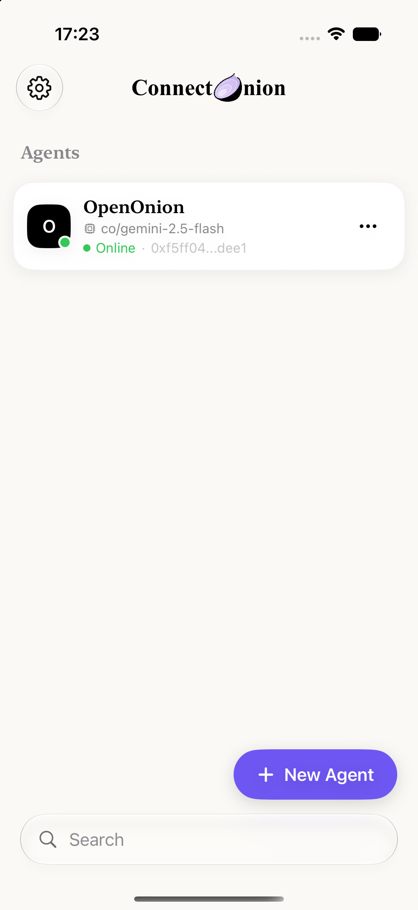

# ConnectOnion iOS - Installation Manual

This manual is for COMP9900 Software Quality assessors who need to build and
exercise the submitted native iOS client. It describes the repository at the
submission commit.

## 1. What is included

The submission ZIP contains the SwiftUI app, WidgetKit extension, unit and UI
tests, test fixtures, GitHub Actions workflows, documentation, and an optional
real-agent E2E helper. The ConnectOnion agent runtime and public relay are
external services; the app can still be built and explored using its mock UI
test mode without them.

## 2. Prerequisites

- macOS with Xcode 26 and the iOS 26 SDK.
- An iOS 26 Simulator (an iPhone simulator is sufficient), or an appropriately
  signed physical iPhone.
- Internet access for Swift Package Manager to resolve the pinned packages on
  the first build.

Docker is not applicable: this is a native iOS application that must run in an
iOS simulator or on a device. The project should be assessed using the steps
below. This arrangement is consistent with the assessment specification's
mobile-app exception.

## 3. Build and run

1. Unzip the submission and open `ConnectOnion iOS.xcodeproj` in Xcode 26.
2. Allow Swift Package Manager to resolve the pinned dependencies.
3. Select the `ConnectOnion iOS` scheme.
4. Select an iOS 26 iPhone simulator.
5. Build and run (Cmd+R).

The first-run screen provides an Add Agent action. For a live interaction,
enter a reachable ConnectOnion agent address and endpoint. A local agent on a
physical iPhone must use the host machine's LAN address rather than `localhost`;
the phone and host must be mutually reachable.

### Running on a physical iPhone

1. Connect the iPhone by cable or enable wireless debugging, then select it in
   Xcode's run-destination menu.
2. Select the **ConnectOnion iOS** scheme and press the Run button (the play
   icon) or use Cmd+R.
3. If iOS blocks the first launch, on the phone open **Settings > General > VPN
   & Device Management**, select the developer/team entry, then tap **Trust**.
   Return to Xcode and run again.

This trust action is only required for a development-signed physical device;
the iOS Simulator does not require it. The selected Apple account/team must be
authorised to sign the bundle identifier configured in the Xcode project.

### Example simulator result

The following screenshot was captured after building and running the submitted
app on an iPhone 17 Pro Simulator. It shows the initial agent list and the
**New Agent** entry point.



## 4. Assessment paths

### Mock UI path (no external agent required)

Run the UI tests in Xcode with Cmd+U. The app uses deterministic seeded,
in-memory data when launched with `--ui-testing`; this exercises chat rendering,
streaming state, agent and conversation management, approvals, questions,
onboarding, plan review, and navigation without external services.

### Live-agent path (optional)

For a real protocol round trip, see `scripts/README.md` and run:

```bash
./scripts/run_e2e.sh
```

This requires Xcode 26, `connectonion>=1.5.3`, and a ConnectOnion identity/API
key created by `co auth`. The helper starts a local test agent, drives the app
through a signed WebSocket session, and cleans up afterwards.

## 5. Testing evidence

The `ConnectOnion iOSTests` target covers protocol encoding/decoding, address
validation, direct and relay routing, event reduction, error/retry behaviour,
agent QR payloads, persistence/session handling, attachments, personalisation,
and markdown rendering. `ConnectOnion iOSUITests` covers seeded and empty
launches, streaming chat, editing/regeneration, agent and conversation CRUD,
and interactive workflow cards.

GitHub Actions runs the unit and UI suite on every push via
`.github/workflows/ios-tests.yml`. The live-agent E2E test is intentionally
separate because it depends on external credentials and a compatible runtime.

## 6. Limitations and troubleshooting

- The app is a client, not an agent host: a live conversation requires a
  compatible remote ConnectOnion agent.
- The public relay/directory is external to this repository; its availability
  is outside the app's control.
- On a simulator, camera capture is unavailable; use the photo-based QR
  fallback. On a physical device, grant the relevant permissions when prompted.
- If a local physical-device connection fails, confirm the firewall, LAN
  reachability, `/info` endpoint, and WebSocket endpoint. University, guest,
  VPN, and client-isolated Wi-Fi can block peer-to-peer access.
- A completion indication after the app has been fully closed and a dedicated
  iPad layout are recorded as assessed follow-up work, not confirmed delivery
  commitments. The main iPhone flow remains the supported assessment path.

For detailed architecture, security considerations, release checks, and a
complete troubleshooting guide, see `docs/CLIENT_HANDOVER.md`.
