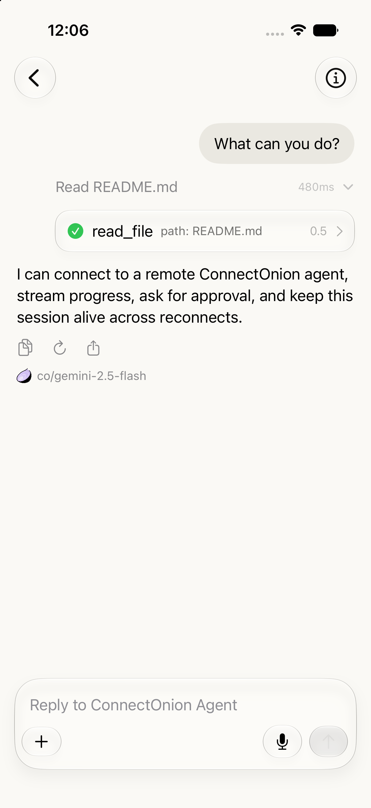
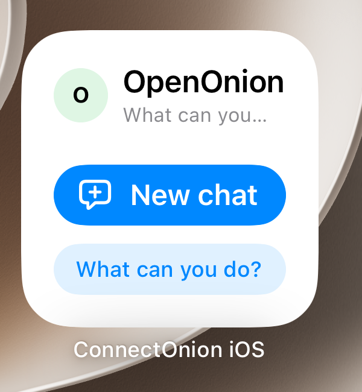
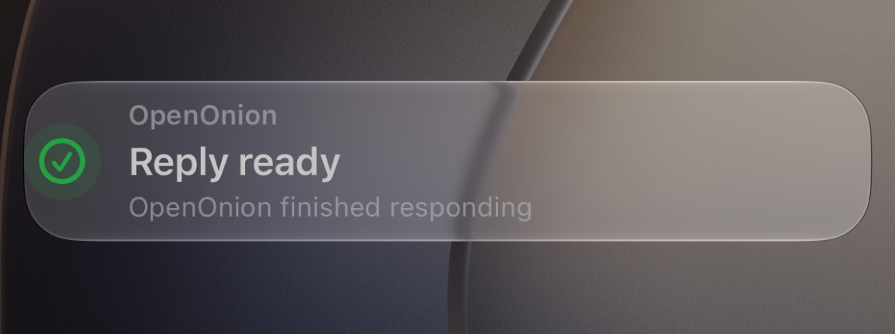
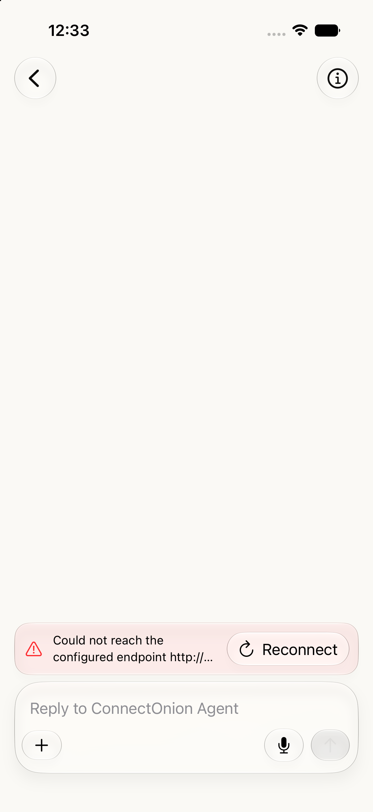

# ConnectOnion App Screenshot Index

These screenshots are committed beside the handover documentation so relative image links render
on GitHub without relying on the untracked demo workspace or paths containing spaces.

| Screenshot | Handover evidence |
|---|---|
|  | Agent-first navigation, connected status, saved conversation, new chat, and search. |
|  | Agent list, offline status, identity address, and recovery context. |
|  | Tool activity, final assistant output, reply controls, and composer. |
|  | Multi-turn history, collapsed tool calls, resolved approvals, and generated image output. |
|  | Explicit Approve, Always, and Skip choices with attachments. |
|  | Slash-command discovery and the composer while entering a skill request. |
|  | Address, name, endpoint, and QR entry. |
|  | Simulator/device scanning fallback through Photos. |
|  | New-chat shortcut and suggested prompt. |
|  | Completed reply status outside the App. |
|  | Endpoint error with a reconnect action. |

The screenshots are visual evidence for the current build. They do not replace source review,
protocol fixtures, GitHub Actions, or manual device validation.
