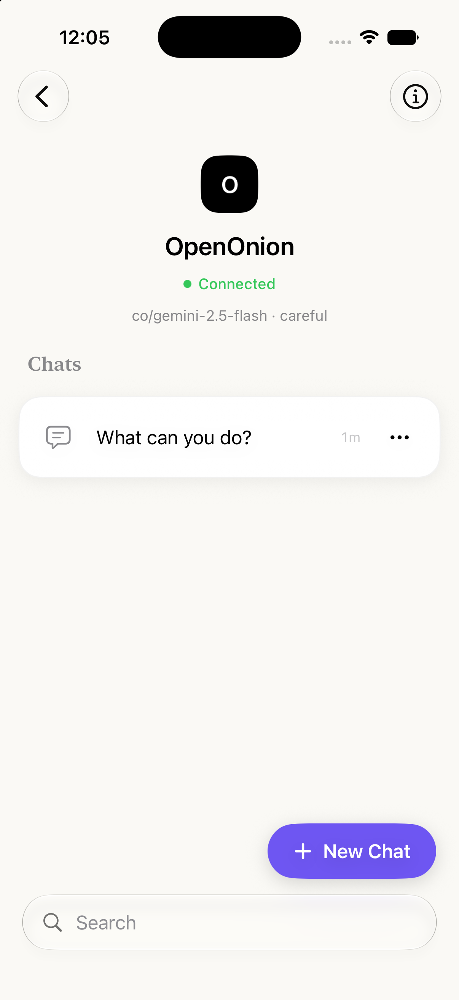

# Shell and Navigation Requirements

## Purpose

The Shell module owns app entry, top-level agent-first navigation, list-level management actions,
search, deep-link routing, launch/welcome presentation, and coordination between persistent records
and active chat sessions.

## Desired outcome

A user should always understand:

- which agent they are viewing;
- whether they are starting a new chat or opening an existing one;
- how to return to their agent and conversation lists;
- which conversations are active or unread;
- how to search, pin, rename, and delete saved items.

## App evidence

The agent home is the shell's primary visible destination. It shows the connected status, the
conversation list, the new-chat entry point, and search affordance together.

*Figure: agent-first shell and persistent conversation entry point.*

## Scope

- first-run and returning-user launch states;
- root agent list;
- agent home and its conversation list;
- typed navigation routes;
- new-chat and existing-conversation destinations;
- search/filtering;
- pin, rename, and delete actions;
- settings and agent-editor presentation;
- deep-link dispatch into shell destinations;
- foreground/background coordination for status refresh and unread state.

## Non-goals

- message rendering and event reduction;
- network protocol implementation;
- detailed settings controls;
- Widget or Live Activity presentation;
- remote agent management.

## User stories

- As a first-time user, I want a clear action to add an agent.
- As a returning user, I want to open an agent and see its recent chats.
- As a frequent user, I want pinned agents and chats to remain easy to reach.
- As a user with many items, I want to search by meaningful names or addresses.
- As a user waiting for an agent, I want to see running and unread indicators outside the chat.
- As a user following a widget or Live Activity link, I want to arrive at the intended destination.
- As a user deleting content, I want an explicit confirmation before irreversible local deletion.

## Functional requirements

| ID | Priority | Requirement | Acceptance criteria |
|---|---|---|---|
| SHELL-001 | P0 | The root hierarchy MUST be agent → agent home → new/existing conversation. | Every chat destination resolves through a saved agent address. |
| SHELL-002 | P0 | The first-run state MUST expose an obvious add/scan-agent action. | With zero saved agents, the empty state is visible and can launch agent entry. |
| SHELL-003 | P1 | Returning users with saved agents SHOULD see the launch brand animation once per launch. | The animation does not repeatedly appear after adding the first agent in the same session. |
| SHELL-004 | P0 | UI-test boot mode MUST bypass time-dependent launch presentation. | Accessibility queries are not delayed by the splash under `--ui-testing`. |
| SHELL-005 | P0 | Navigation MUST use stable identifiers rather than retaining model objects in route values. | Agent routes use addresses and conversation routes use UUIDs. |
| SHELL-006 | P1 | The shell MUST show running state for conversations with active retained sessions. | Leaving a generating chat does not remove its activity indicator. |
| SHELL-007 | P1 | The shell MUST show unread state when an off-screen reply completes. | Opening the conversation while active clears unread state. |
| SHELL-008 | P1 | Pinning MUST produce a deterministic order with the most recently pinned item first. | Pinned items precede unpinned items; normal recency/order remains stable within groups. |
| SHELL-009 | P1 | Rename MUST support cancellation and an explicit/intentional commit. | Dismissing without commit does not silently apply a partial name. |
| SHELL-010 | P0 | Deleting a conversation MUST stop and remove its retained chat session. | No network work or running indicator remains for the deleted UUID. |
| SHELL-011 | P0 | Deleting an agent MUST also resolve its locally owned conversations and active sessions according to the confirmed destructive action. | No orphaned chat remains navigable after deletion. |
| SHELL-012 | P1 | Destructive actions MUST require confirmation. | The agent/chat remains intact if the dialog is cancelled. |
| SHELL-013 | P1 | Search MUST be case-insensitive and match user-recognisable identity fields. | Local alias, remote/display name, shortened/full address, and conversation title are considered where applicable. |
| SHELL-014 | P1 | A valid deep link MUST route to scanner, new chat, or an existing local conversation. | The navigation path is rebuilt without duplicate route pushes. |
| SHELL-015 | P1 | An invalid or stale deep link MUST fail without corrupting navigation. | Missing agent/conversation data leaves the user in a valid shell state. |
| SHELL-016 | P2 | Agent profile refresh SHOULD prioritise the currently focused agent while continuing periodic refresh for the list. | Focus changes update refresh behavior; backgrounding stops unnecessary polling. |
| SHELL-017 | P1 | Widget snapshot publication MUST follow relevant agent, conversation, and profile changes. | Widget data refresh is requested after a meaningful snapshot update. |
| SHELL-018 | P1 | Appearance selection MUST apply to the whole presented app hierarchy. | Sheets and pushed destinations use the selected appearance consistently. |

## Route contract

| Route | Identifier | Preconditions | Destination |
|---|---|---|---|
| Agent home | Agent address | Matching saved agent | Agent hero, capabilities, chats |
| New chat | Agent address | Matching saved agent | Fresh landing/composer |
| Conversation | Local UUID | Matching conversation and saved agent | Chat screen |

If a destination cannot be resolved, the shell must not force-unwrap or display an unrelated record.
The preferred recovery is to return to the nearest valid list and allow the user to retry.

## Search and ordering rules

### Agents

1. Pinned agents appear first.
2. More recently pinned agents appear before older pins.
3. Unpinned ordering follows the current product ordering.
4. Search should not permanently modify the stored order.

### Conversations

1. Only conversations belonging to the selected agent are shown.
2. Pinned conversations appear first.
3. Recent update time is the normal secondary ordering.
4. Active and unread indicators do not themselves reorder the list.

## Interaction rules

- Long-press/context menus and swipe actions must have accessible button alternatives.
- Inline rename should not conflict with row navigation.
- Background taps may commit an active rename only when this behavior is visible and tested.
- Sheets and full-screen scanner presentations must return to a valid navigation state.
- Deletion confirmation should name the object type and avoid ambiguous generic wording.
- The settings entry point must remain reachable from the root shell.

## Edge cases

- No saved agents.
- An agent is deleted while its editor or home is presented.
- A conversation is deleted while its reply is active.
- A deep link arrives during another sheet/full-screen presentation.
- A deep link references an unknown conversation UUID.
- A new-chat deep link references an unknown agent address.
- The app becomes inactive while a reply completes.
- A profile refresh changes the display name while search is active.
- SwiftData returns records in a different base order after relaunch.
- The user rapidly taps the same navigation action multiple times.

## Non-functional requirements

- Root navigation actions should respond without network dependency.
- List updates should animate without losing VoiceOver focus where practical.
- The shell must not create a second app-level `ChatSessionStore`.
- Scene transitions should stop unnecessary agent polling.
- UI test identifiers must remain stable for primary navigation and destructive confirmations.

## Source ownership

Primary sources:

- `Features/Shell/AppShellView.swift`
- `Features/Shell/AgentListView.swift`
- `Features/Shell/AgentSidebarRow.swift`
- `Features/Shell/ConversationSidebarRow.swift`
- `Features/Shell/InlineRenameField.swift`
- `Features/Shell/WelcomeView.swift`
- `Core/ChatLogic/ChatSessionStore.swift`

Related tests:

- UI tests for launch, navigation, rename, delete, and sidebar access;
- session-store tests for off-screen completion and deletion;
- deep-link round-trip tests.

## Dependencies

- Agent Management supplies agent records and display metadata.
- Chat supplies running/unread session state.
- Persistence supplies agents and conversations.
- System Integrations supplies deep-link requests and widget snapshot types.
- Settings supplies appearance selection.

## Future considerations

- State restoration for a complete navigation path after process termination.
- Universal Links and user-visible invalid-link feedback.
- Bulk conversation management.
- Split-view behavior specifically designed for iPad.
- Explicit archive separate from destructive delete.

## Definition of done

A Shell change is done when route resolution, empty state, list ordering, destructive behavior,
deep-link implications, retained-session cleanup, accessibility, and UI-test coverage have all been
reviewed.
