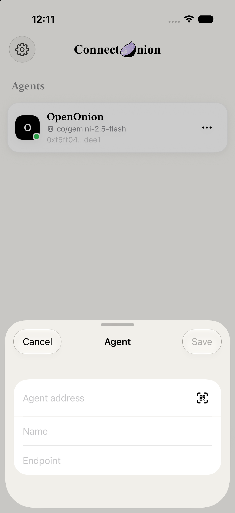
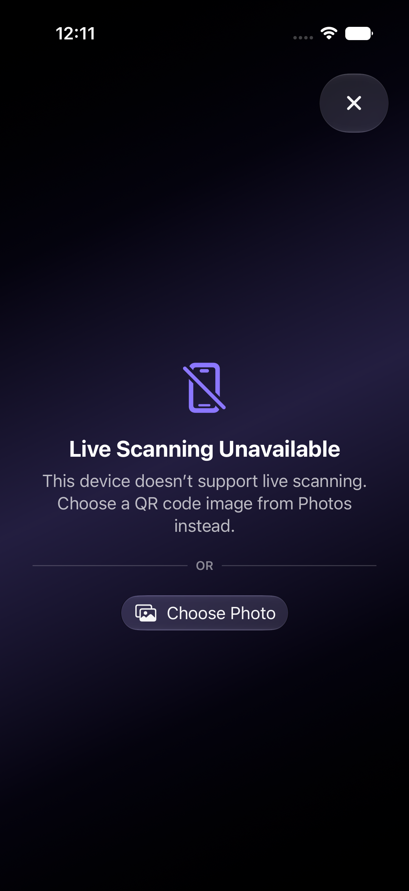
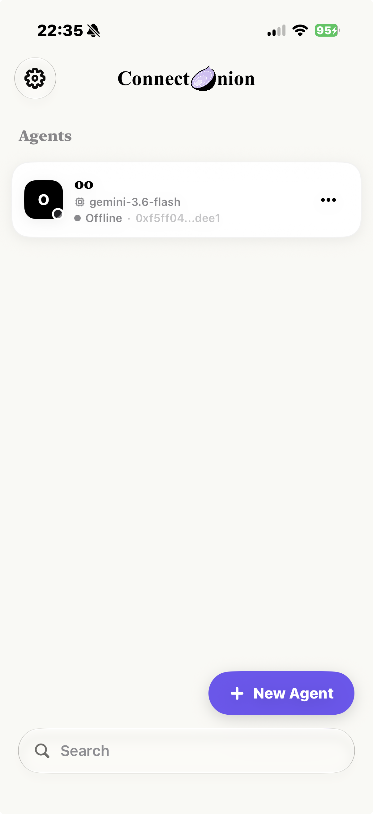

# Agent Management Requirements

## Purpose

The Agent module lets users create and maintain the local representation of remote ConnectOnion
agents. It also presents server-owned profile information, online status, tools, skills, accepted
inputs, and entry points into conversations.

## Desired outcome

A user should be able to add the correct agent, recognise it later, understand its current
capabilities, and start a conversation without needing to understand the directory protocol.

## App evidence

Agent entry is a reviewable form with a QR affordance, while simulator/device capability limits are
reported as an explicit scanner fallback rather than an implicit failure.

  
  
  

*Figure: add-agent review flow, QR capability fallback, and offline status presentation.*

## Scope

- manual agent entry;
- QR scanner and QR payload decoding;
- address validation and normalisation;
- optional local alias;
- optional preferred endpoint;
- edit, pin, rename, and delete;
- cached remote profile;
- online/offline presentation;
- capability and suggested-prompt presentation;
- agent home and fresh-chat landing experience.

## Non-goals

- changing the remote agent's profile;
- installing or modifying remote tools/skills;
- guaranteeing online status;
- managing relay registration;
- storing remote service credentials.

## User stories

- As an agent operator, I want to share a QR code that fills all required connection details.
- As a user, I want to paste an address and optionally provide a local endpoint.
- As a user, I want to give an agent a name that makes sense to me.
- As a user, I want to see whether the agent appears available.
- As a user, I want to inspect the agent's tools, skills, model, and supported inputs.
- As a user, I want suggestions that help me start a useful first conversation.
- As a user, I want to correct an endpoint without recreating the agent.

## Functional requirements

| ID | Priority | Requirement | Acceptance criteria |
|---|---|---|---|
| AGT-001 | P0 | An agent address MUST be validated and normalised before storage. | Invalid addresses cannot create a saved agent; valid supported forms resolve to the canonical address. |
| AGT-002 | P0 | The stored address MUST remain the stable identity key for the agent. | Editing alias or endpoint does not create a different agent identity. |
| AGT-003 | P1 | The user MAY set a local alias independent of remote profile data. | Local alias is displayed first and survives profile refresh. |
| AGT-004 | P1 | The user MAY set or clear a preferred HTTP(S) endpoint. | A later route resolution uses the updated value and falls back if it is unreachable. |
| AGT-005 | P0 | QR scanning MUST show a clear permission/unavailable state and MUST not save unvalidated data automatically. | Parsed fields populate a reviewable add flow or are validated before persistence. |
| AGT-006 | P1 | The QR parser SHOULD support current add links, bare addresses, and documented legacy forms. | Existing QR compatibility tests remain green. |
| AGT-007 | P1 | Duplicate agent handling MUST be deterministic. | The user is prevented from accidental duplicates or is directed to edit the existing address record. |
| AGT-008 | P1 | Profile information MUST be treated as remote, refreshable data. | Name, model, tools, skills, trust, version, and accepted inputs may update without overwriting the local alias. |
| AGT-009 | P1 | A direct profile response MUST match the requested address. | Mismatched `/info` data is not accepted as the saved agent's profile. |
| AGT-010 | P1 | Agent status MUST distinguish usable information from certainty. | Offline presentation does not claim the agent can never be reached; connection still performs route resolution. |
| AGT-011 | P2 | Status refresh SHOULD use hysteresis to avoid brief failures causing visible flapping. | A transient failed poll does not immediately replace a recently confirmed online state. |
| AGT-012 | P1 | The agent landing screen MUST provide a clear new-chat action. | The user can start with an empty prompt, typed prompt, or supported suggestion. |
| AGT-013 | P1 | Capability sections MUST handle missing or empty data gracefully. | Empty tools/skills sections are hidden or represented intentionally, never as broken placeholders. |
| AGT-014 | P1 | Composer input affordances SHOULD follow `accepted_inputs` when supplied. | Unsupported input types are not presented as available. |
| AGT-015 | P1 | Deleting an agent MUST require confirmation and resolve its local conversations. | Cancellation preserves all records; confirmation leaves no orphaned navigation. |
| AGT-016 | P2 | Pinning an agent MUST persist across launches. | Pinned order restores from stored pin timestamps. |
| AGT-017 | P2 | Suggestions MUST be usable as actual initial input, not decorative text. | Selecting a suggestion starts or prepares the corresponding new conversation predictably. |
| AGT-018 | P0 | Agent connection status MUST remain `Checking` until the first status fetch completes. | Initial load never renders unknown state as Offline; manual refresh remains active until the shared refresh queue has processed the requested agents. |

## Field rules

### Address

- Required.
- Canonical `0x`-prefixed public-key-derived form.
- Whitespace and supported presentation variants may be normalised.
- Must not be mutated after agent creation through the edit screen.

### Local alias

- Optional.
- Leading/trailing whitespace should not create a visually blank alias.
- Takes display precedence over the remote name.
- Does not alter the remote agent.

### Preferred endpoint

- Optional.
- Represents an HTTP(S) base URL used for `/info` and conversion to `/ws`.
- Must not require the user to enter `/info` or `/ws`.
- Loopback works in the simulator but is not a usable route from a physical phone to another host.
- Failure must allow relay fallback.

## Display-name rules

Display name precedence:

1. non-empty local alias;
2. non-empty remote profile name;
3. shortened valid address;
4. full stored address.

If a local alias differs from the remote name, the UI may show the remote name as secondary context.
It must not imply the local alias is server-owned.

## Status and profile refresh

- A reachable preferred direct endpoint establishes online status even without relay presence.
- Otherwise the directory record may provide relay status and advertised endpoints.
- Direct `/info` can enrich relay profile data.
- Focused agents may be polled more often than background-list agents.
- Agents in the same refresh batch should be probed concurrently so one slow endpoint does not block every other status.
- Polling stops or reduces when the app is inactive.
- Cached profile data provides continuity but must not be represented as a fresh online guarantee.

## QR payload behavior

The scanner/parser collaboration must cover:

- percent-encoded alias/name values;
- optional endpoint;
- optional or alternate address key names supported by the protocol;
- address in a trailing path where documented;
- bare address;
- legacy hosted URL;
- malformed and foreign payload rejection.

Adding a new QR format requires fixtures and a compatibility decision. Do not remove a previously
supported format without migration/communication for existing printed codes.

## Edge cases

- Camera permission denied.
- Camera unavailable or simulator without camera input.
- QR contains only an address.
- QR contains invalid URL encoding.
- QR points to an endpoint that serves a different agent.
- Preferred endpoint is stale but relay is healthy.
- Remote profile has no name, tools, or skills.
- Local alias matches remote name only by case.
- Two saved records attempt to use the same address.
- An agent is deleted while status refresh is in flight.
- Profile refresh returns after the endpoint has been edited.

## Non-functional requirements

- Status polling must be bounded and cancellable.
- Profile decoding should tolerate optional fields.
- Capability lists should remain readable with long tool/skill names.
- QR scanning must provide VoiceOver guidance and a non-camera manual-entry alternative.
- No remote profile content should be trusted as safe rich text without sanitisation appropriate to
  its rendering context.

## Source ownership

Primary sources:

- `Features/Agents/AgentEditorView.swift`
- `Features/Agents/AgentQRCodeScannerView.swift`
- `Features/Agents/AgentQRCodePayload.swift`
- `Features/Agents/AgentInfoStore.swift`
- `Features/Agents/AgentHomeView.swift`
- `Features/Agents/AgentLandingView.swift`
- `Core/Models/Agent/*`
- `Core/Persistence/AgentConfigRecord.swift`
- `Core/Network/Directory/*`

Related tests:

- address validation tests;
- QR payload tests;
- routing fallback tests;
- display-name precedence tests;
- agent landing and capability UI tests;
- add/rename/delete UI tests.

## Cross-team dependencies

- Agent/runtime owns `/info` fields and accuracy.
- Relay owns directory records and presence.
- Shell owns list ordering and destructive navigation.
- Composer respects accepted input capabilities.
- QA should maintain physical-device QR and LAN test cases.

## Future considerations

- Share/export an agent configuration.
- Universal Link form for agent add.
- Explicit certificate/trust presentation.
- Multiple environment profiles for development/staging/production.
- Operator-provided branded avatar with safe caching.
- Non-destructive agent archive.

## Definition of done

An Agent change is done when validation, duplicate behavior, local-versus-remote ownership, route
fallback, cached data, capability emptiness, scanner/manual accessibility, persistence, and
compatibility tests are addressed.
