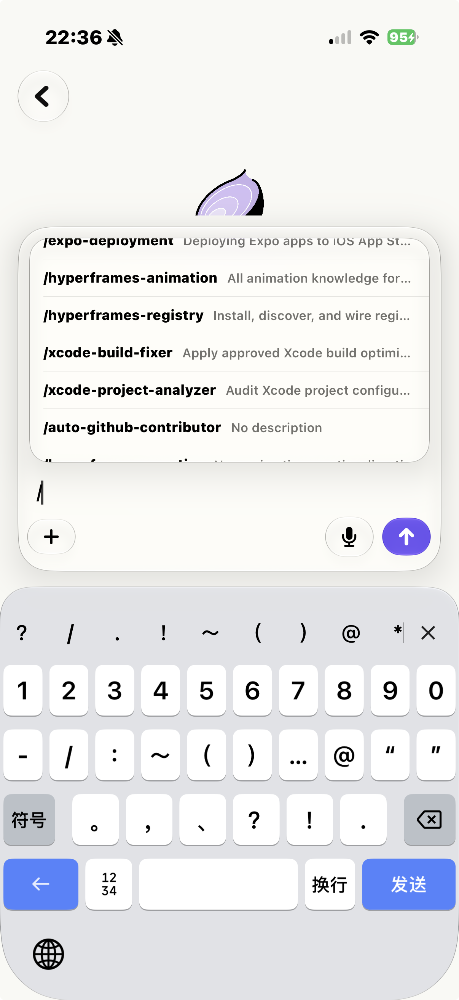

# Composer and Input Requirements

## Purpose

The Composer module converts user intent into a valid `AgentInput`. It owns text entry, attachment
selection and preview, camera/photo/file access, voice transcription, input validation, size
budgeting, and the send affordance used by new and existing conversations.

## Desired outcome

Users should be able to prepare a supported request confidently, understand why an input cannot be
sent, and avoid losing their draft because an optional input source fails.

## App evidence

The conversation surface shows the attachment strip above the user turn and keeps the reply
composer available below the timeline.

  
  

*Figure: attachment-aware input (left) and slash-command discovery (right).*

## Scope

- multiline text input;
- send eligibility;
- photo library and recent photos;
- camera capture;
- file picker;
- attachment previews and removal;
- image conversion/compression;
- file/data URL encoding;
- attachment count and size constraints;
- voice recording/transcription;
- agent input-capability filtering;
- personalisation wrapper capture at send time.

## Non-goals

- uploading large files to an external storage service;
- editing file contents;
- recording/sending raw voice audio;
- remote skill execution;
- rendering received files.

## User stories

- As a user, I want to send a text request.
- As a user, I want to attach photos or files with or without text.
- As a user, I want oversized input explained before send.
- As a user, I want to remove an attachment from the draft.
- As a user, I want to dictate text when typing is inconvenient.
- As a user, I want the composer to reflect what the selected agent accepts.
- As a user, I want a failed picker or permission request not to erase existing draft content.

## Functional requirements

| ID | Priority | Requirement | Acceptance criteria |
|---|---|---|---|
| COMP-001 | P0 | Send MUST be enabled only when there is meaningful text or at least one valid attachment. | Blank whitespace without attachments cannot be sent; attachment-only input can be sent. |
| COMP-002 | P0 | The composer MUST prevent duplicate send while the current input is being submitted. | Rapid taps produce one input ID/turn. |
| COMP-003 | P1 | The user MUST be able to add and remove draft attachments before send. | Preview strip accurately matches the outgoing input. |
| COMP-004 | P0 | The maximum attachment count MUST be enforced consistently. | The default limit is 10 and the UI explains when no more can be added. |
| COMP-005 | P0 | Individual source files MUST be validated against the source-size policy. | Files above the default 10 MiB selection limit are rejected clearly. |
| COMP-006 | P0 | The combined encoded input MUST fit the transport frame budget. | Estimated validation occurs before send and the transport performs a final 900 KiB check. |
| COMP-007 | P1 | Images MUST be normalised and compressed to a transport-safe JPEG payload. | Orientation/rendering is valid and the encoded result respects the supplied budget. |
| COMP-008 | P1 | File payloads MUST preserve a safe display name and MIME type where available. | Outgoing file objects contain name and data URL. |
| COMP-009 | P0 | Picker, encoding, or permission failure MUST not silently send a partial unintended request. | The user sees an error and can edit/retry the remaining draft. |
| COMP-010 | P1 | The composer SHOULD expose only input types accepted by the agent when capability data is available. | Unsupported camera/photo/file actions are absent or disabled with explanation. |
| COMP-011 | P1 | Voice input MUST produce editable text, not immediate automatic send. | User can review/correct the transcript before sending. |
| COMP-012 | P0 | Voice input MUST handle microphone and speech permission denial. | Denial produces a recoverable state and text input remains usable. |
| COMP-013 | P1 | Sending MUST capture the current personalisation settings for that input. | Later settings changes affect regenerate/new sends according to their own send time, not past visible text. |
| COMP-014 | P1 | The visible user message MUST exclude transport-only personalisation wrappers. | Timeline shows only what the user intended as the request. |
| COMP-015 | P1 | Camera/photo/file entry points MUST remain available in both fresh-chat and existing-chat composers where supported. | Shared behavior is consistent across both contexts. |
| COMP-016 | P2 | Keyboard dismissal after send SHOULD not interrupt attachment processing or create layout corruption. | Composer resets to a clean ready state after accepted send. |
| COMP-017 | P2 | Skill-command UI MUST expose every available match without expanding the composer beyond its intended mobile viewport. | Typing `/` opens a fixed-height scrollable palette, and the fresh-chat skill disclosure can scroll the page to every skill. |

## Current limits

| Constraint | Default |
|---|---:|
| Attachment count | 10 |
| Source file size | 10 MiB |
| Encoded input frame | 900 KiB |
| Estimation safety margin | 64 KiB |

The source-file limit is not a promise that any 10 MiB file can be sent inline. Base64 expansion and
the combined frame limit are stricter. Product copy should explain the actionable result rather than
expose internal arithmetic.

## Image processing contract

1. Decode supported image data.
2. Correct/normalise its render orientation.
3. Flatten to an opaque JPEG-compatible representation.
4. Try progressively smaller maximum dimensions and quality values.
5. Select the first candidate within the encoded budget.
6. Reject if even the smallest supported candidate is too large.
7. Use the processed preview/payload consistently.

Do not introduce an image path that bypasses final frame validation.

## Voice state rules

Possible states include:

- idle;
- requesting permission;
- listening;
- transcribing;
- stopped with transcript;
- unavailable;
- failed.

The user must always have an obvious way to stop recording and return to ordinary text input.
Temporary speech failure must not clear previously typed text.

## Draft lifecycle

- A draft belongs to its current composer context.
- Opening an attachment sheet must not reset text.
- Removing a preview removes it from the eventual outgoing input.
- After accepted send, the sent text/attachments clear from the composer.
- After failed initial send, the product must preserve enough input for a useful retry or clearly
  restore it through the chat transaction.
- A suggestion selected on agent landing becomes actual input through the same validation pipeline.

## Edge cases

- Text consists only of whitespace.
- Ten attachments already exist.
- A selected file is zero bytes.
- A selected file has no known MIME type.
- Base64 expansion pushes the combined frame over budget.
- Multiple images individually fit but not together.
- Image decoding fails.
- Camera is unavailable.
- Photo permission is limited.
- Speech recognition is unavailable for the locale.
- Permission changes while the app is open.
- The agent advertises text-only input.
- Personalisation wrapper increases total prompt size.
- Attachment-only latest-turn edit.

## Non-functional requirements

- Image processing should avoid blocking interactive typing and scrolling.
- Attachment payloads must not be logged.
- Temporary image/file data should not be copied more than necessary.
- Composer controls require VoiceOver labels, selected states, and understandable errors.
- Dynamic Type must not hide the send, stop-recording, or remove-attachment actions.

## Source ownership

Primary sources:

- `Features/Composer/ChatInputBar.swift`
- `Features/Composer/AttachmentSheet.swift`
- `Features/Composer/AttachmentStrip.swift`
- `Features/Composer/ComposerAttachmentPreviews.swift`
- `Features/Composer/CameraPicker.swift`
- `Features/Composer/RecentPhotos.swift`
- `Features/Composer/VoiceRecordingBar.swift`
- `Core/Speech/VoiceInputTranscriber.swift`
- `Core/Support/AttachmentEncoding.swift`
- `Core/Network/Client/AgentInput.swift`
- `Core/Support/CustomInstructions.swift`

Related tests:

- attachment encoding/budget tests;
- attachment-only send tests;
- attachment recovery tests;
- custom-instruction transport tests;
- composer UI tests;
- landing suggestion and composer UI tests.

## Dependencies

- Agent Management provides accepted input capabilities.
- Settings provides personality/custom instructions.
- Chat owns send transaction and persistence.
- Network enforces the final frame size.
- iOS permission configuration supplies purpose strings.

## Future considerations

- Separate authenticated upload flow for large files.
- Draft persistence across process termination.
- Richer attachment type validation.
- On-device transcription configuration and language selection.
- Paste/drop support on iPad.
- Attachment scanning or security classification.

## Definition of done

A Composer change is done when send eligibility, capability filtering, draft preservation, encoded
budget, picker/permission failures, attachment-only input, voice recovery, accessibility, and
transport-level validation are covered.
