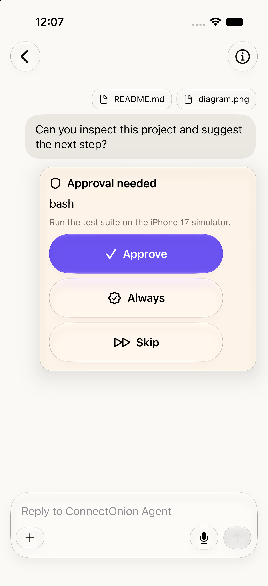
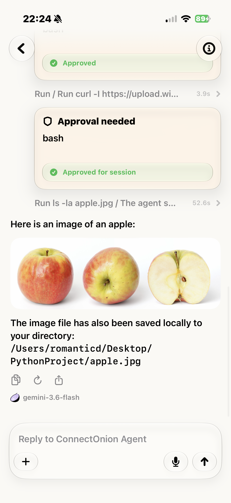

# Interactive Agent Workflow Requirements

## Purpose

This module specification covers server-driven interaction that requires the user to make a
decision or provide information during an agent run. These workflows are safety- and
continuity-critical because they interrupt ordinary streaming and must resume the correct remote
session.

## App evidence

Approval requests are presented as a dedicated card with the requested tool, context, and distinct
choices rather than as an undifferentiated chat message.

  
  

*Figure: pending approval choices (left) and resolved approvals in a multi-turn tool history (right).*

## Scope

- ask-user requests;
- tool approvals and rejection;
- approval scope/mode/feedback;
- plan review approval or revision;
- onboarding requirements, invite code, and payment fields;
- onboarding success/rejection and retry;
- blocked tools;
- work-limit/waiting states;
- interactive-card resolution and canonical reconciliation.

## Non-goals

- server-side authorization policy;
- payment processing implementation;
- validating the safety of the remote tool itself;
- designing the agent's plan;
- generic form-building outside protocol-defined ask-user fields.

## User stories

- As a cautious user, I want to approve or reject a tool before it runs.
- As a user, I want to answer an agent's question in the format it expects.
- As a user, I want to approve a plan or request a revision.
- As a new user, I want to complete an invite/onboarding gate and continue my original request.
- As a user, I want clear feedback when onboarding is rejected and a way to retry.
- As a user, I want resolved cards to remain resolved after reconnect.

## Global requirements

| ID | Priority | Requirement | Acceptance criteria |
|---|---|---|---|
| INT-001 | P0 | Every interactive card MUST be tied to the current conversation/session. | A response is never sent on another conversation's transport. |
| INT-002 | P0 | The session MUST enter a waiting state when user action is required. | UI and Live Activity reflect waiting rather than indefinite generic running. |
| INT-003 | P0 | Submitting a response MUST prevent duplicate submission. | Repeated taps produce one protocol response and a clear pending state. |
| INT-004 | P0 | Successful local submission MUST mark the card resolved. | Composer and session state return to the expected post-response mode. |
| INT-005 | P0 | Failed submission MUST keep or restore an actionable unresolved state. | User can retry without recreating the conversation. |
| INT-006 | P0 | Canonical server snapshots MUST NOT reopen a locally resolved card without evidence of a new request. | Answered/approved state survives reconciliation. |
| INT-007 | P1 | Card copy MUST identify what the user is deciding and the consequences available from the payload. | Generic “Continue” is avoided when approve/reject/revise is known. |
| INT-008 | P1 | Interactive controls MUST remain accessible without gestures. | VoiceOver can discover, understand, and activate every response. |
| INT-009 | P1 | Sensitive field values MUST not be rendered back into ordinary timeline text unless explicitly required. | Password-style ask fields remain masked and are not logged. |
| INT-010 | P1 | Unknown/malformed interactive payloads MUST fail visibly and safely. | The app does not send a guessed response shape. |

## Ask-user requirements

| ID | Priority | Requirement | Acceptance criteria |
|---|---|---|---|
| ASK-001 | P1 | The app MUST support free-text answer requests. | Non-empty valid text can be submitted. |
| ASK-002 | P1 | The app MUST support option selection and multi-select when declared. | Selection rules match `multi_select`. |
| ASK-003 | P1 | The app MUST support structured field input for declared text/password fields. | Required values are collected and password fields are masked. |
| ASK-004 | P1 | The submitted answer MUST be encoded in the response format expected by the current protocol. | Agent resumes and the card displays the resolved answer state appropriately. |
| ASK-005 | P2 | Existing typed values SHOULD survive a recoverable send failure. | Retry does not require re-entering every field. |

## Approval requirements

| ID | Priority | Requirement | Acceptance criteria |
|---|---|---|---|
| APR-001 | P0 | Approval UI MUST show the requested tool and available description/context. | User can distinguish the action before approving. |
| APR-002 | P0 | Approve and reject MUST be visually and semantically distinct. | VoiceOver traits/labels and destructive styling communicate the choice. |
| APR-003 | P1 | Approval scope MUST be sent exactly as selected/required. | Single and batch scope do not become interchangeable. |
| APR-004 | P1 | Optional mode and feedback MUST only be included when supplied. | Empty feedback does not produce misleading content. |
| APR-005 | P1 | Resolving an approval MUST release the ordinary composer from stale waiting state. | The user can continue after server flow completes. |

## Plan-review requirements

| ID | Priority | Requirement | Acceptance criteria |
|---|---|---|---|
| PLAN-001 | P1 | The card MUST present the plan content in readable form. | Long plans remain scrollable and accessible. |
| PLAN-002 | P1 | The user MUST be able to approve or request revision. | Both actions send an unambiguous review message. |
| PLAN-003 | P1 | A revision request SHOULD allow meaningful feedback. | Empty or accidental revision submission is prevented where feedback is required. |
| PLAN-004 | P1 | Resolved plan review MUST not reappear after canonical reconciliation. | Local resolved state is preserved unless a new plan-review event arrives. |

## Onboarding requirements

| ID | Priority | Requirement | Acceptance criteria |
|---|---|---|---|
| ONB-001 | P0 | Onboarding requirements MUST be shown as a dedicated gate, not a generic error. | Invite/payment methods from the payload are represented clearly. |
| ONB-002 | P0 | The original triggering input MUST be retained while onboarding is pending. | Successful onboarding automatically resumes/resends the original input once. |
| ONB-003 | P0 | Onboarding submission requiring signature MUST use the client identity. | The outgoing envelope contains valid canonical signature fields. |
| ONB-004 | P0 | Rejection/error MUST reopen the card with an actionable inline error. | The user can correct and retry the invite code. |
| ONB-005 | P0 | Generic errors unrelated to pending onboarding MUST NOT create or reopen an onboarding card. | Error classification depends on actual pending state. |
| ONB-006 | P1 | Successful onboarding MUST clear pending verification state before resuming input. | The original request is not resent repeatedly. |
| ONB-007 | P1 | Payment-related copy MUST not claim that the iOS app processes payment unless it actually does. | UI accurately represents protocol data and external responsibility. |

## Tool and work-limit notices

- `tool_blocked` must explain that an action could not proceed.
- A work/turn-limit event must be visible and move the session to waiting or an otherwise actionable
  terminal state.
- Tool call and result activity remains informational unless a separate approval is required.
- A completed tool result should not regress to running due to later out-of-order data.

## State and retry rules

1. Receive interactive event.
2. Add/update one corresponding timeline item.
3. Move conversation to waiting.
4. Collect and validate user response locally.
5. Disable duplicate action while submitting.
6. Send through the conversation's active client.
7. Mark resolved locally on success.
8. Continue processing server events.
9. Restore actionable state with an error on failure.

For onboarding, retain the original `AgentInput` separately until success or explicit cancellation.

## Edge cases

- Ask-user options array is empty.
- Multi-select request has one option.
- Structured fields include an unknown type.
- Approval arrives while another card is already pending.
- Batch-approval remaining count is missing.
- User navigates away while a card is pending.
- Transport disconnects after local tap but before acknowledgement.
- Server canonical state still contains an unresolved copy of a locally answered card.
- Onboarding success arrives twice.
- Onboarding rejection uses a generic `ERROR` type.
- Original onboarding-triggering input contains attachments.
- Plan content is empty or malformed.

## Security and privacy

- Treat tool names/descriptions and plan content as untrusted remote content.
- Do not log answers, invite codes, password fields, or payment details.
- Approval presentation must not imply the iOS app verified the remote action's safety.
- Any future native payment collection requires a separate legal, App Store, and security review.

## Source ownership

Primary sources:

- `Features/Chat/Cards/AskUserCard.swift`
- `Features/Chat/Cards/ApprovalNeededCard.swift`
- `Features/Chat/Cards/ApprovalButtons.swift`
- `Features/Chat/Cards/PlanReviewCard.swift`
- `Features/Chat/Cards/OnboardRequiredCard.swift`
- `Core/ChatLogic/ChatEventReducer.swift`
- `Features/Chat/ChatViewModel.swift`
- `Core/Network/Client/ProtocolCodec.swift`

Related tests:

- ask-user text/options/fields UI tests;
- approval UI tests;
- onboarding first-prompt, success, rejection, and retry tests;
- plan-review UI tests;
- reducer tests for waiting/resolution/canonical merge.

## Cross-team dependencies

- Agent/runtime owns request payloads and response interpretation.
- Protocol owners must document acknowledgement and idempotency behavior.
- Chat owns waiting state and retained sessions.
- Security/product owners approve the meaning and copy of approval modes.
- QA needs live-agent validation for server-controlled timing.

## Future considerations

- Explicit protocol correlation IDs for every interactive request/response.
- Server acknowledgements and idempotency tokens.
- Richer approval risk summaries.
- Expiry/cancellation of stale pending cards.
- Native secure credential handoff without putting secrets in chat history.

## Definition of done

An interactive-workflow change is done when waiting transitions, validation, duplicate prevention,
retry, resolved-state reconciliation, accessibility, sensitive-data handling, protocol mocks, and UI
coverage are complete.
